[](https://github.com/laborima/ocearo-ui/issues)
[](CONTRIBUTING.md)
[](https://opensource.org/licenses/Apache-2.0)

[English 🇺🇸](README.md)

# Ocearo UI

**La navigation rendue plus intelligente**

**Ocean Robot** va transformer la navigation avec une interface utilisateur (UI) intuitive et visuellement attrayante conçue pour le projet OpenPlotter. Basé sur la plateforme **Signal K**, Ocean Robot collecte et stocke les données du bateau pour fournir des informations en temps réel.

Inspiré par l'interface de l'autopilote Tesla, ce système offre une expérience futuriste et épurée adaptée aux navigateurs.

---

## **Dernières mises à jour (v0.1.22)**

- **Trace au mouillage** : la vue mouillage dessine le chemin réellement parcouru autour de l'ancre, avec le vrai rayon d'alarme, l'anneau de veille à 80 % et la ligne de mouillage. Un changement de veine de courant ou une ancre qui commence à déraper se lit à la forme de la trace bien avant que l'alarme ne parte. La trace est enregistrée côté serveur par ocearo-core, elle survit donc à un rechargement de l'interface.
- **Compas style KIP** : l'onglet navigation du tableau de bord porte désormais une rose tournante à ligne de foi fixe, avec index de COG et de vent apparent, dessinée en SVG. Il remplace le widget bateau 3D, qui faisait tourner un rendu WebGL permanent pour afficher un cap.
- **Onglet Raspberry Pi** : température, CPU, mémoire et disque de la machine qui héberge la pile, indicateurs de bridage du firmware et processus les plus gourmands — le moyen le plus rapide de voir pourquoi l'ordinateur de bord rame.
- **Horloge GPS** : sans pile sur sa RTC, le Pi démarre à une date fausse après une coupure sans internet, ce qui vidait silencieusement le widget marées. L'interface prend maintenant son heure de `navigation.datetime` (GPS) dès que l'horloge système dérive de plus d'une minute.
- **Fin des `NaN` sur le vent** : tous les convertisseurs d'unités rejettent désormais les valeurs non finies au lieu de propager `NaN` jusqu'au DOM, et les endroits qui avalaient un `NaN` en zéro silencieux ont disparu.
- **Vrai CPA AIS** : le risque de collision est calculé à partir du cap et de la vitesse des deux navires et non plus de la seule distance ; un bateau amarré par le travers n'est plus signalé comme dangereux.
- **Profondeur au journal de bord**, et saisies manuelles enregistrées dans les mêmes unités que les entrées automatiques.

> ℹ️ Certaines fonctions ont besoin de plugins Signal K compagnons pour avoir des données à afficher — voir [Prérequis Signal K](#prérequis-signal-k).

---

## **Prérequis Signal K**

L'interface lit des chemins Signal K standards ; quand un chemin n'est pas publié, l'affichage correspondant est vide plutôt que cassé. Sur un bateau NMEA2000 classique, ce sont ces plugins qui font exister les chemins :

| Plugin | Fournit | Utilisé par |
|--------|---------|-------------|
| [`signalk-derived-data`](https://www.npmjs.com/package/signalk-derived-data) | Vent vrai et cap vrai à partir du vent apparent et de la vitesse surface (activer `heading`, `angleTrueWater`, `directionTrue`) | Affichages de vent, réglage de voiles, polaires, compas |
| [`@meri-imperiumi/signalk-autostate`](https://www.npmjs.com/package/@meri-imperiumi/signalk-autostate) | `navigation.state` | Visibilité des voiles, hiérarchisation des alertes |
| [`@signalk/set-system-time`](https://www.npmjs.com/package/@signalk/set-system-time) | Horloge système recalée sur l'heure GPS | Marées, rendu jour/nuit, tri du journal |
| [`@signalk/signalk-autopilot`](https://www.npmjs.com/package/@signalk/signalk-autopilot) | API pilote automatique Signal K v2 | Vue pilote automatique (qui indique désormais explicitement l'absence de fournisseur au lieu d'afficher un panneau inerte) |
| [`ocearo-core`](https://www.npmjs.com/package/ocearo-core) | Journal de bord, mouillage, métriques système, copilote IA | Journal, trace au mouillage, onglet Raspberry Pi |

---

## **Mises à jour précédentes (v0.1.19)**

- **Plan de maintenance moteur** : Nouvel onglet maintenance avec les échéances constructeur (Volvo Penta D1/D2, Yanmar YM, diesel générique), suivi des dernières interventions et statuts en retard/à prévoir.
- **Alarmes moteur** : Les 24 notifications moteur NMEA2000 (surchauffe, pression d'huile, niveau de liquide de refroidissement…) remontent désormais avec un bandeau d'alarme permanent et un badge d'onglet, plus des zones de température configurables levant des alertes sonores SignalK.
- **Carte 3D à l'échelle du port** : Plan de carte à niveau de détail adaptatif — pontons visibles au ponton (OSM z19 + balisage OpenSeaMap), zone large en dézoomant, à l'échelle des cibles AIS.
- **Vraie carte météo** : Le mode météo combine le fond de carte avec l'overlay vent Windy et le radar de pluie RainViewer en direct sur ~40 km.
- **Océan et ciel vivants** : Houle géométrique fonction du vent (hauteur significative estimée), nuages et pluie pilotés par les prévisions, ciel océan partagé par tous les modes carte.
- **Qualité de l'air via COV** : Tuile du tableau de bord pilotée par la résistance de gaz du BME680 (kΩ) avec échelle qualitative en l'absence de capteurs CO₂/PM2.5.
- **Analyse carburant** : Estimation en plage (pire–moyenne conso), hypothèse plein complet après ravitaillement, heures moteur conservées moteur coupé, historique complet des pleins.
- **Performances RPi5** : Les modes carte/météo utilisent un océan allégé sans passe de réflexion — la scène n'est plus rendue deux fois par image.
- **Points forts précédents (v0.1.16)** : voiles 3D avec réglage physique, tensions de gréement, HUD de réglage, vue autopilote, tableau de bord, unités configurables, stack Next.js 16 / React 19 / Tailwind v4.

---

## **Caractéristiques Clés**

### **Environnement 3D Dynamique**
- **Voiles Physiques** : Représentation 3D en temps réel de la grand-voile et du foc/génois avec cambrure, vrillage et prise de ris dynamiques selon le vent.
- **Gréement Interactif** : Visualisation des lignes de gréement (pataras, hale-bas, cunningham, bordure) avec dégradés de couleurs selon la tension.
- **Compas Intelligent** : **HUD de réglage** intégré affichant les positions recommandées des chariots pour une performance optimale.
- **Ciel Jour/Nuit** : Éclairage dynamique et environnement océanique synchronisés avec l'heure du navire.

### **Navigation et Conscience Situationnelle**
- **Radar AIS** : Visualisation 3D des navires à proximité avec des panneaux d'informations détaillés.
- **Routes et Navigation** : Widget dédié pour les routes Signal K, les waypoints et les calculs de navigation en temps réel.
- **Contexte Environnemental** : Niveaux de marée, prévisions météo (API Signal K) et surveillance de la profondeur avec assiette du navire.
- **Laylines** : Visualisation haute précision des laylines en 3D pour l'aide à la navigation tactique.

### **Systèmes du Navire**
- **Contrôle Autopilote** : Interface autopilote entièrement intégrée pour une gestion fluide du navire.
- **Surveillance Moteur** : Jauges complètes pour les températures, pressions et consommation de carburant avec suivi des pleins.
- **Indicateurs Style Tesla** : Barres modernes haute visibilité pour l'état des batteries et les niveaux de réservoirs.
- **Interface Personnalisable** : Support de 12 langues et unités configurables (métrique, impérial, nautique).

---

## **Vues Principales**

### **Vue Croisière**
- **Visualisation 3D** : Fournit une vue 3D dynamique du navire, affichant des éléments critiques tels que :
  - Direction du vent avec **laylines actives**
  - Compas 3D de haute précision
  - Niveau de profondeur et assiette du navire
  - Navires à proximité représentés en 3D via les données AIS
  - **HUD de réglage des voiles** : Indicateurs en arc en temps réel pour le chariot de GV et les chariots de foc au niveau du compas.
  - Forme de voile basée sur la physique (cambrure et vrillage) reflétant les conditions de vent actuelles.

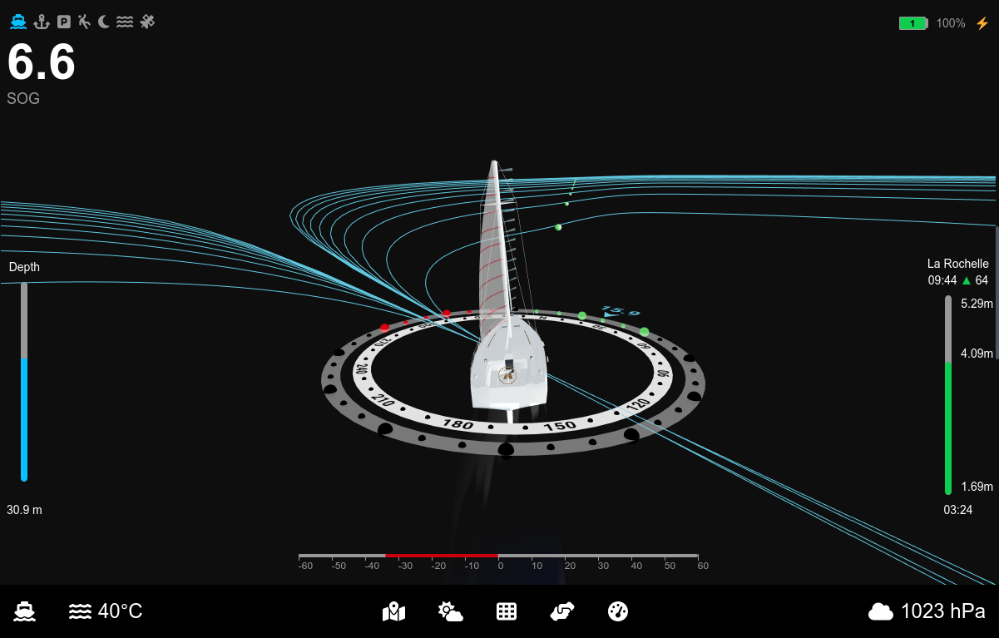

### **Vue au Mouillage**
- Représentation 3D simplifiée du navire avec les données clés au mouillage :
  - Position GPS
  - Heure
  - Niveaux de marée
  - Profondeur
  - État de la batterie
- Cercle d'alarme centré sur le point de mouillage enregistré, au rayon configuré, avec l'anneau de veille à 80 % et la ligne de mouillage
- **Trace de swing** : le chemin parcouru autour de l'ancre, pour voir l'évitage, le bateau qui fait des bords au mouillage et les premiers mètres de dérapage avant toute alarme

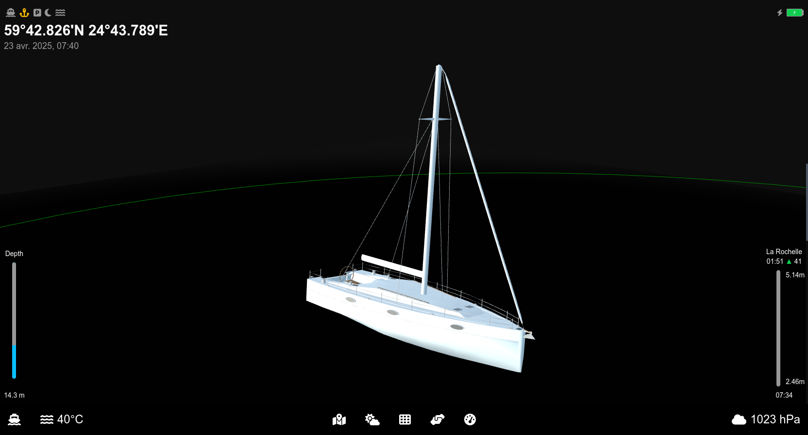

### **Vue Aide au Stationnement**
- Utilise les données des caméras et capteurs pour simplifier l'accostage :
  - Affichage des prédictions de trajectoire selon le vent et l'angle de barre
  - Indications de vitesse et flux vidéo en direct de la caméra avant
  - Mise en évidence des places de port disponibles

*En cours de développement.*

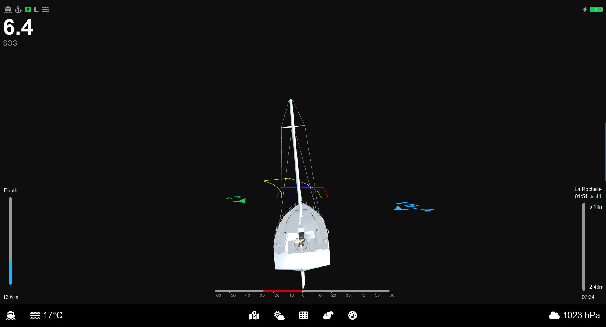

### **Autres Vues**
Visuels additionnels améliorant les fonctionnalités du système :

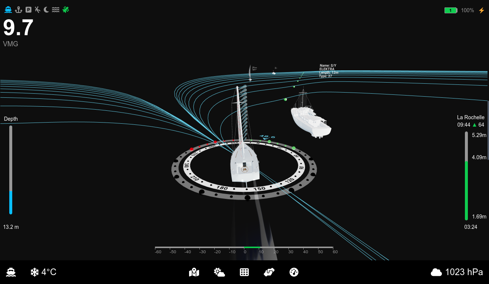  
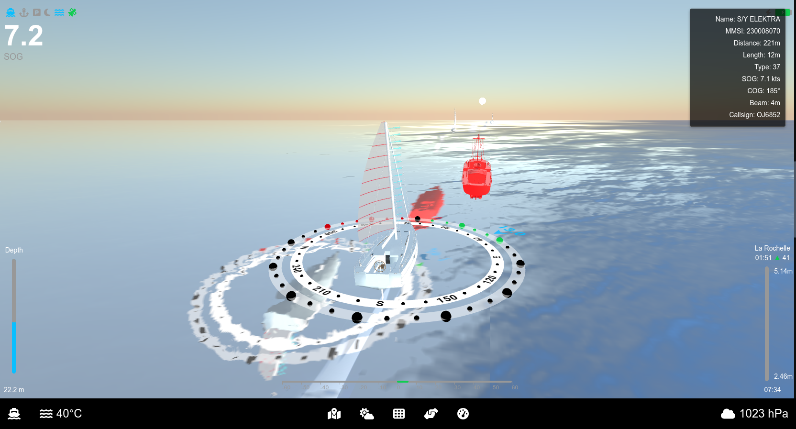
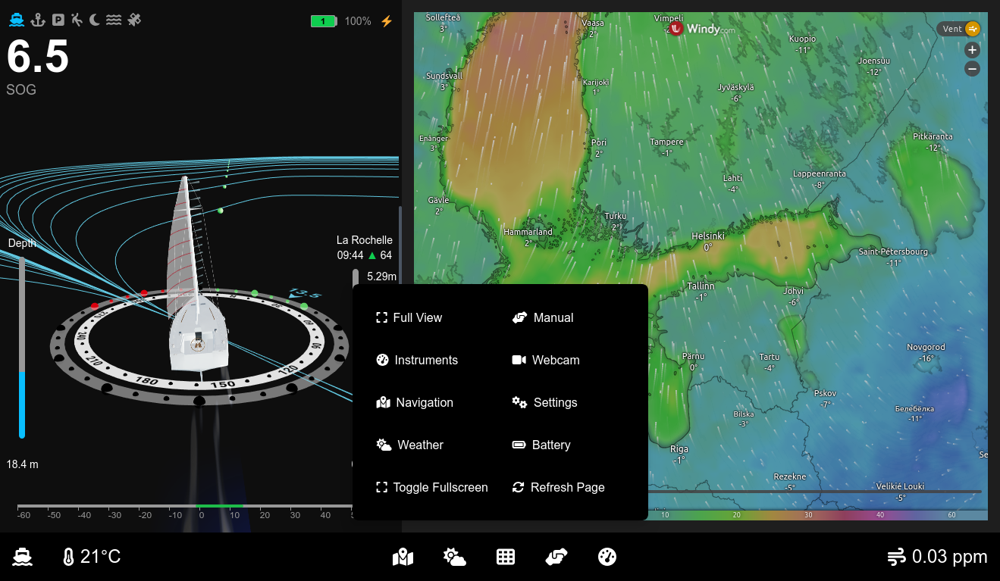  
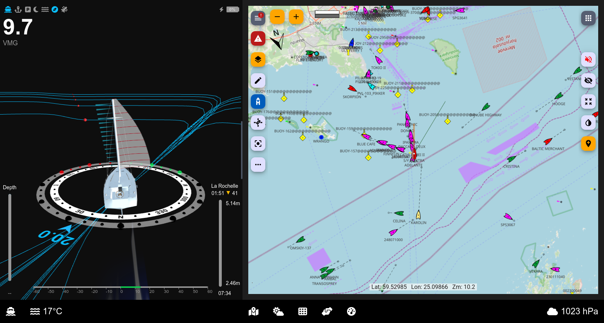  
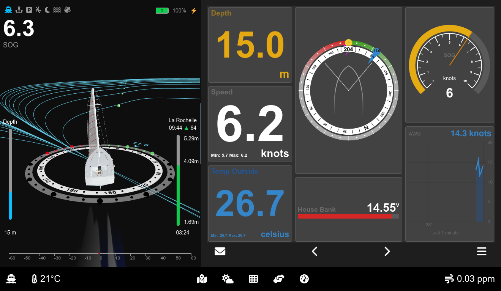
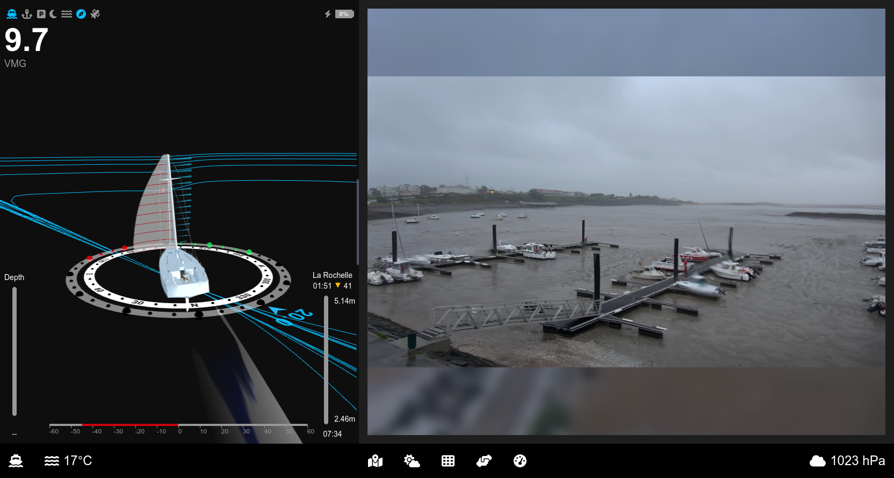
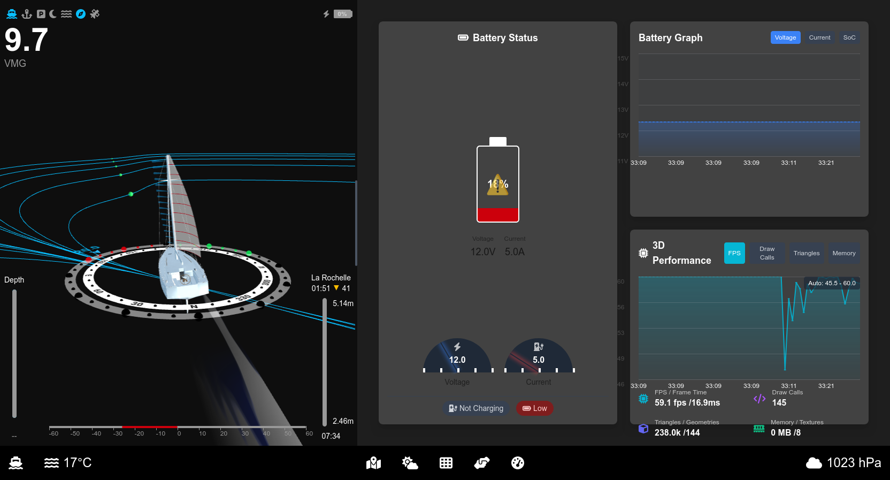
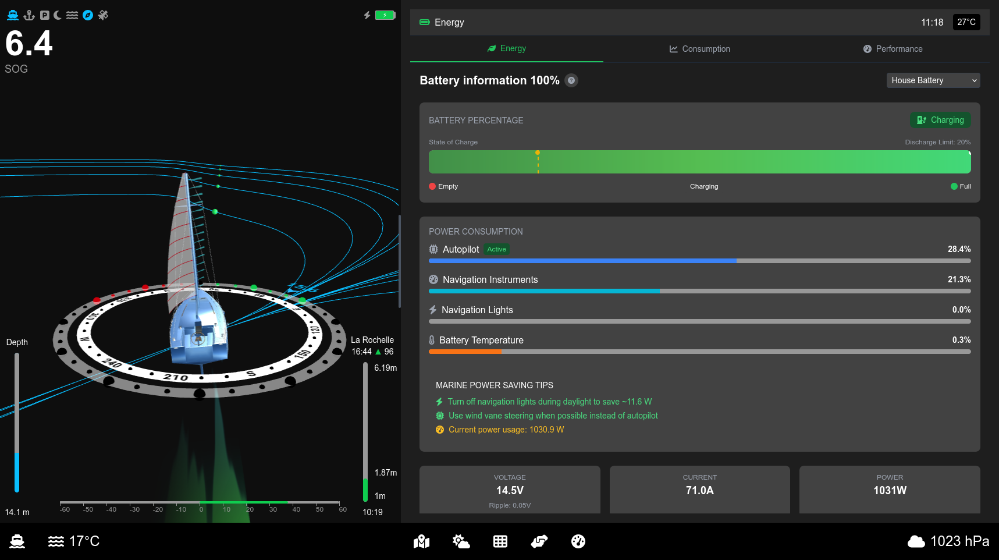
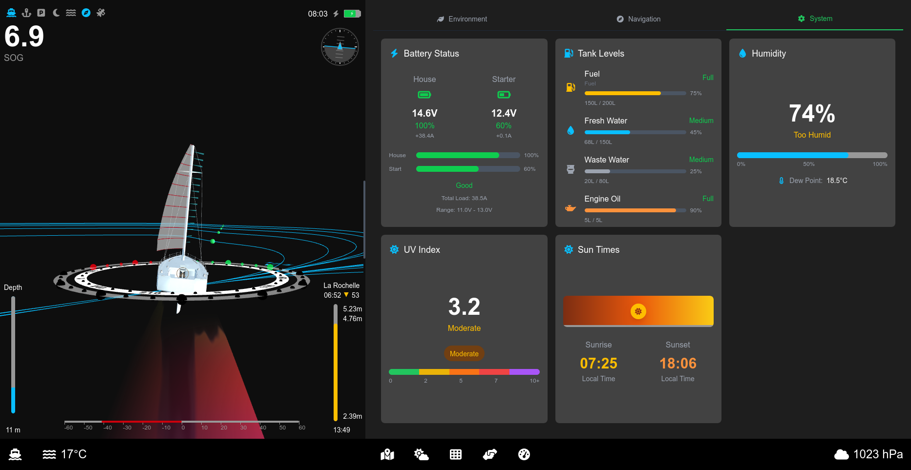
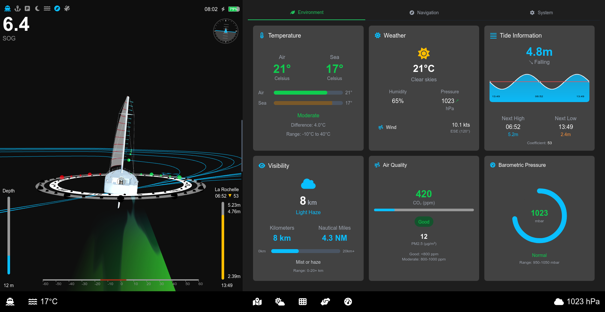
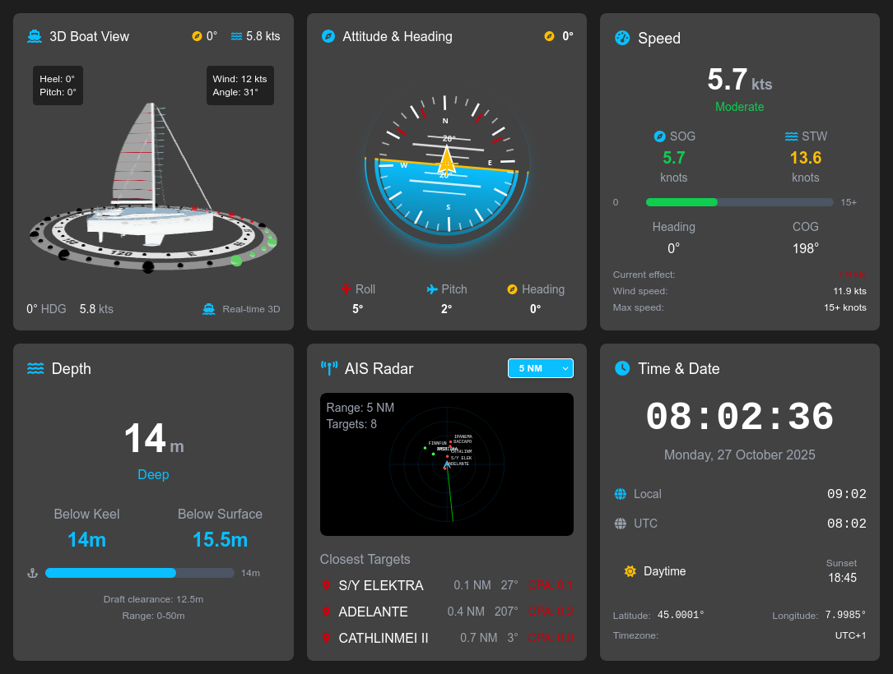
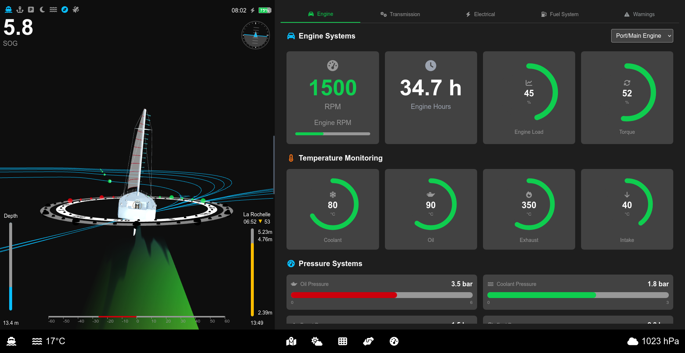

---

## **Vision pour le Futur**
La feuille de route d'Ocean Robot inclut des fonctionnalités avancées visant à améliorer la sécurité et l'efficacité :

- **Détection d'objets par IA** pour les débris flottants et obstacles
  - Intégration avec des systèmes de caméras avancés (ex: **see.ai**)
- **Améliorations futures** :
  - Surveillance par caméra des penons pour des suggestions de réglage optimal
  - Visualisation de la bathymétrie en 3D
  - Visualisation des lignes de départ en 3D

---

Démo en direct : https://laborima.github.io/ocearo-ui/

Ou installez-le dans Signal K via le paquet NPM : https://www.npmjs.com/package/ocearo-ui

---

## **Contribution**

Votre soutien rend Ocearo UI meilleur ! Voici comment vous pouvez contribuer :

- Signaler des bugs : Aidez-moi à corriger les problèmes en me signalant ce qui ne fonctionne pas.
- Suggérer des fonctionnalités : Partagez vos idées pour de nouvelles fonctionnalités.
- Contribuer au code : Soumettez des "pull requests" pour ajouter des fonctionnalités ou corriger des bugs.
- Soutenir le projet : Aidez à financer l'achat de webcams et de capteurs en m'offrant un café.

[](https://www.buymeacoffee.com/laborima)

---

## **Développement et Déploiement**

### Compilation

Cloner les sources :

```bash
git clone https://github.com/laborima/ocearo-ui.git
cd ocearo-ui
```

Installer les dépendances :

```bash
npm install
```

Démarrer le serveur de développement :

```bash
npm run dev
```

Accéder à l'interface sur [http://localhost:3000](http://localhost:3000).

### Modèles de Bateaux
Tous les modèles 3D ont une longueur de flottaison de 10 mètres et sont positionnés à 0 sur l'axe Y. Utilisez Blender pour les ajustements.

---

### Configuration des Marées
Créez des fichiers JSON sous le chemin suivant :
`public/tides/${harbor}/${MM}_${yyyy}.json`

Un script d'exemple permet de télécharger les données pour La Rochelle.

---

## **Déploiement sur OpenPlotter**

La méthode recommandée est d'utiliser le paquet npm publié.
Pour déployer votre propre compilation :

```bash
git clone https://github.com/laborima/ocearo-ui.git
cd ocearo-ui
npm install
NODE_ENV=production npm run build
scp -r ./out/* pi@openplotter.local:/home/pi/.signalk/node_modules/ocearo-ui
```

---

⚠ Avertissement de Navigation

Utiliser avec précaution – Ne remplace pas les systèmes de navigation officiels.

Ocearo UI est conçu pour améliorer la conscience situationnelle et visualiser les données en temps réel. Cependant, ce logiciel n'est pas un système de navigation ou de sécurité certifié.

- Vérifiez toujours les données avec les cartes marines officielles et les appareils GPS.
- Gardez une conscience situationnelle et suivez les règles de sécurité maritime.
- Les développeurs d'Ocearo UI ne sont pas responsables des incidents ou erreurs de navigation liés à l'utilisation de ce logiciel.

En utilisant Ocearo UI, vous acceptez les risques inhérents à l'utilisation d'outils de navigation non certifiés. Naviguez de manière responsable !
