[](LICENSE)
[](https://www.npmjs.com/package/ocearo-ui)
[](https://signalk.org)
[](https://github.com/laborima/ocearo-ui/issues)

[English 🇬🇧](README.md)

<p align="center">
  <picture>
    <source media="(prefers-color-scheme: dark)" srcset="docs/logo/ocearo-logo-dark.svg">
    
  </picture>
</p>

# Ocearo UI

**L’affichage de navigation open source pour Signal K.** Une image 3D claire et en temps réel du bateau, de la mer et du trafic autour — réglage des voiles, règles de barre, homme à la mer, veille au mouillage, bathymétrie et météo — dans une interface sobre inspirée de la visualisation de conduite Tesla. Il tourne comme webapp Signal K sur le serveur du bord (un Raspberry Pi suffit) et dans n’importe quel navigateur à bord : écran de table à cartes, tablette de cockpit ou téléphone.

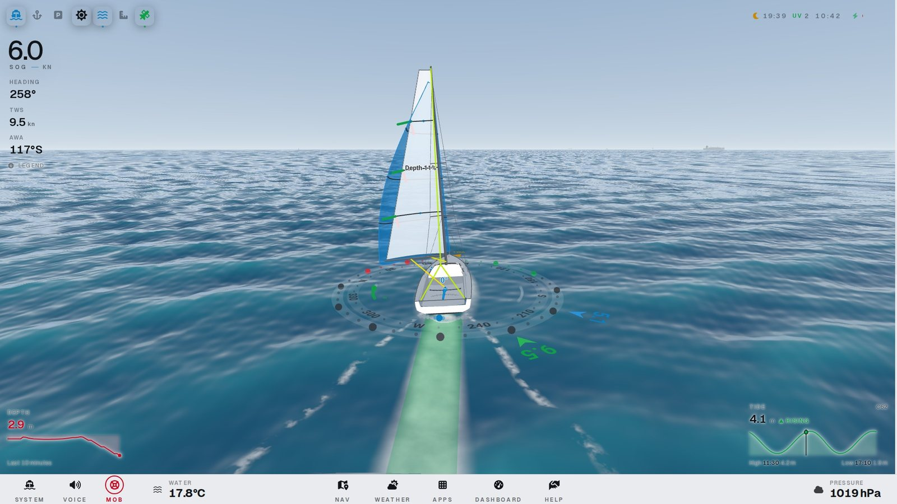

> Toutes les images de cette page sont des captures de l’application, alimentée par des données réelles de La Rochelle du 4 octobre 2026 : vent Open-Meteo, marée, bathymétrie SHOM 20 m et trafic AIS scénarisé.

▶ **Visite en vidéo (2:33) :** [en français](https://youtu.be/GkLjk23Sz8k) · [in English](https://youtu.be/YGQM3UipcvU) — sortie de La Rochelle, règles de barre, homme à la mer, bathymétrie, météo, moteur et journal de bord.

---

## Sommaire

- [Points forts](#points-forts)
- [La vue 3D](#la-vue-3d)
- [Trafic et règles de barre](#trafic-et-règles-de-barre)
- [Sécurité : homme à la mer et mouillage](#sécurité--homme-à-la-mer-et-mouillage)
- [Instruments et systèmes du bord](#instruments-et-systèmes-du-bord)
- [Hors-ligne en mer](#hors-ligne-en-mer)
- [Installation](#installation)
- [Configuration](#configuration)
- [Développement](#développement)
- [Sources de données et crédits](#sources-de-données-et-crédits)
- [Contribuer](#contribuer) · [Licence](#licence) · [Avertissement](#avertissement-de-navigation)

---

## Points forts

- **Un bateau qu’on règle depuis l’écran.** Grand-voile, voiles d’avant et spi asymétrique dessinés d’après le vent (creux, vrillage, ris, changements de voile), avec bandes de creux, penons, chariot de grand-voile et chariots de foc à leur place.
- **La mer autour de vous, de cinq façons.** Une mer réaliste construite à partir du vent réel, la carte en direct avec le balisage, le fond en 3D, la prévision de vent, ou un sol épuré façon FSD pour la régate.
- **Un trafic lisible d’un coup d’œil.** Les cibles AIS dessinées selon leur type et leur taille réels, qui glissent entre deux messages, colorées selon qui doit manœuvrer d’après le RIPAM — avec la manœuvre à faire.
- **La tactique.** Laylines vers le waypoint, isochrones tirées de vos polaires (où vous serez dans 5, 10 et 15 minutes), conseil VMG et bateau fantôme à la vitesse polaire.
- **La sécurité d’abord.** Repère homme à la mer avec dérive estimée, veille au mouillage avec la vraie trace d’évitage, alerte de petits fonds selon votre tirant d’eau.
- **Tout le reste du bord.** Tableau de bord, moteur et entretien, énergie, réservoirs, journal de bord avec rejeu des sorties, pilote automatique, médias et documents — en 12 langues, unités métriques, impériales ou nautiques, thèmes jour, sombre et nuit rouge.
- **Pensé pour le bateau.** Fonctionne hors-ligne une fois la zone téléchargée, s’adapte au Raspberry Pi, ne lit que des chemins Signal K standard.

---

## La vue 3D

Le cœur d’Ocearo est une scène 3D en direct centrée sur votre bateau. Un bouton fait défiler cinq représentations du monde autour.

| | |
|---|---|
| 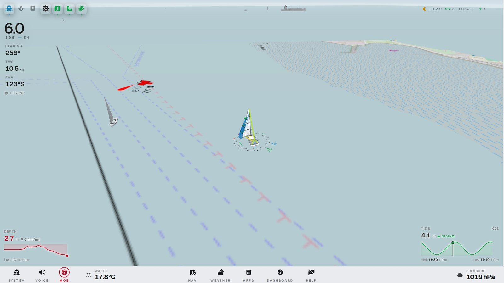 | 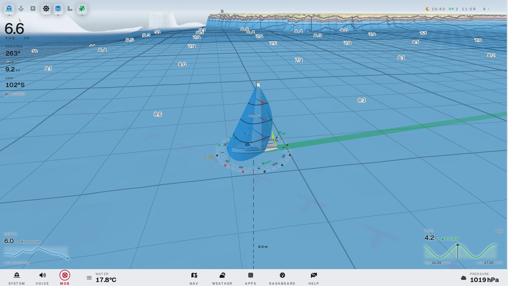 |
| **Carte.** OpenStreetMap avec le balisage et les feux OpenSeaMap, à l’échelle de votre bateau et des cibles AIS. Utilise un fournisseur de cartes Signal K (MBTiles) s’il est installé. | **Bathymétrie.** Le fond en grille de relevé : relief exagéré, isobathes, sondes à la marée du moment, ligne de sondeur depuis la quille, et l’eau trop peu profonde pour votre tirant d’eau hachurée en orange. Relevés SHOM de 5 à 20 m sur les côtes françaises, relief mondial ailleurs. |
| 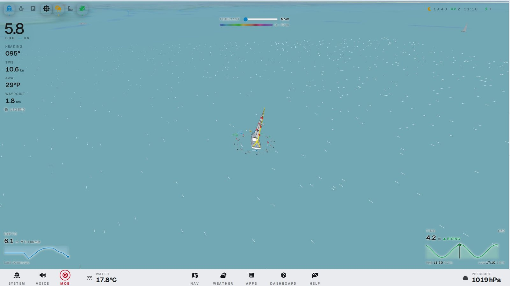 | 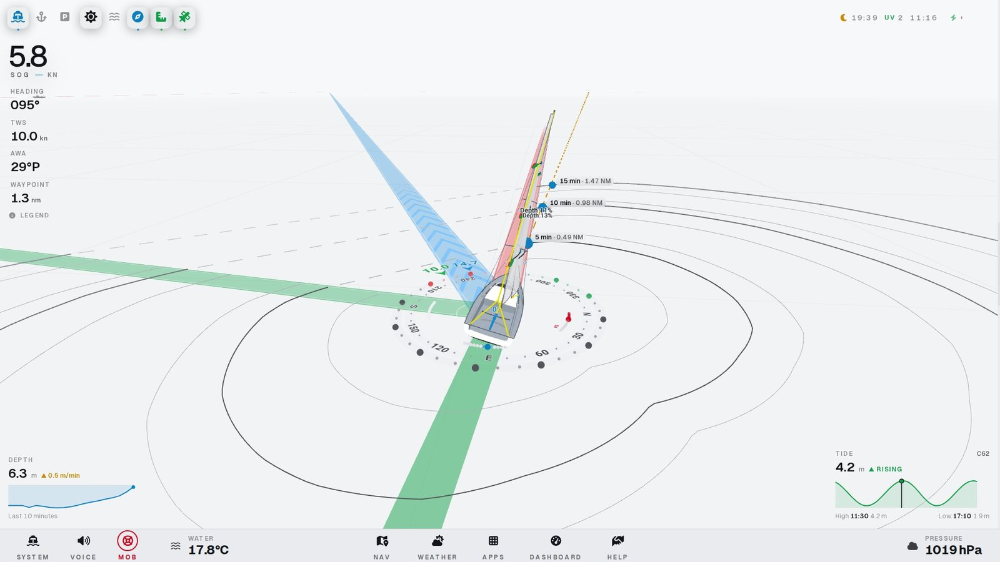 |
| **Météo.** La prévision de vent à 48 h autour du bateau (Open-Meteo) aux couleurs de Windy, avec un curseur de temps. | **Polaires et laylines.** Où les polaires vous mettent dans 5, 10 et 15 minutes à chaque cap, les laylines vers le waypoint et la VMG à suivre. |

La **mer** elle-même est générée à partir du vent réel : hauteur, longueur et direction d’une mer de vent côtière plus une houle, moutons à partir d’environ 7 nœuds, reflet du ciel et soleil à sa vraie place, et votre propre sillage qui suit la route réellement parcourue. Les voiles sont dessinées d’après le vent apparent avec leur réglage : bandes de creux avec la profondeur et la position du creux maximum, penons au guindant et à la chute, et chariots d’écoute sur leurs rails.

Bateaux : un racer de 10,8 m (par défaut), un catamaran de 14 m et des modèles plus simples, au choix dans les réglages.

---

## Trafic et règles de barre

| | |
|---|---|
| 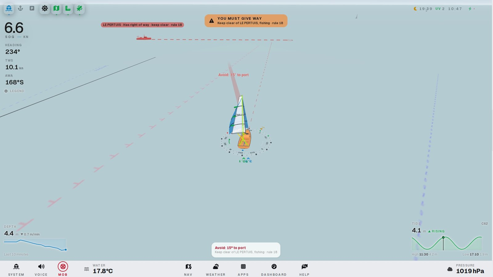 | 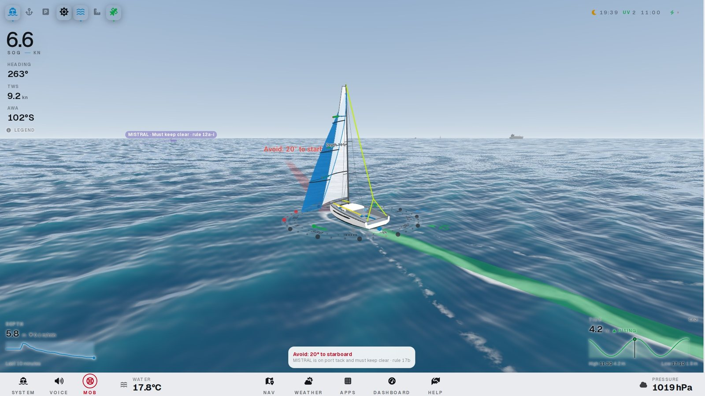 |
| **À nous de manœuvrer.** Un navire en pêche croise devant : d’après la règle 18, le voilier s’en écarte. Le bateau et le bandeau passent en rouge orangé, le conseil nomme la règle et le changement de cap (« Éviter : 15° sur bâbord »). | **À lui de manœuvrer.** Un voilier bâbord amures qui arrive par tribord doit s’écarter (règle 12) : il passe en violet avec la manœuvre attendue de lui. S’il n’agit pas, le conseil de la règle 17 b) apparaît. |
| 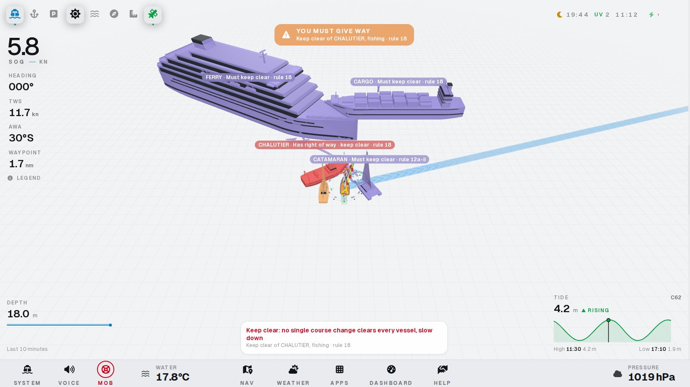 | 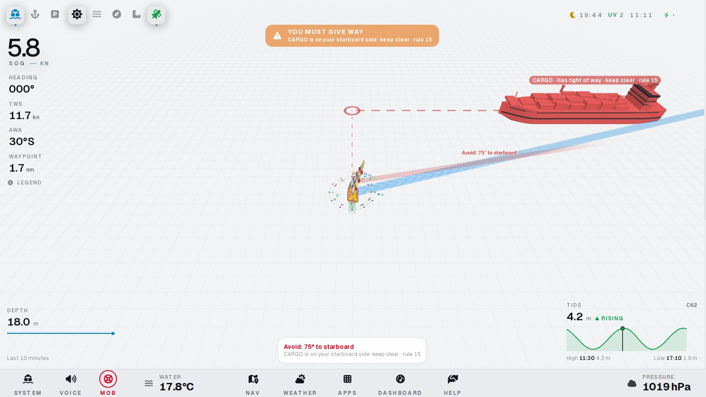 |
| **Trafic dense.** Chaque cible porte son rôle et sa règle : le ferry et le cargo doivent s’écarter d’un voilier sous voiles (18), le catamaran est au vent sur les mêmes amures (12 a-ii), le chalutier est prioritaire. Quand aucun changement de cap ne dégage tout le monde, le conseil le dit et propose de ralentir. | **Au moteur.** Moteur en route, le voilier est un navire à propulsion mécanique : un cargo sur tribord est prioritaire (règle 15). Le conseil passe sur son arrière (« Éviter : 75° sur tribord ») et la ligne pointillée marque le point de rapprochement maximal. |

**Les règles appliquées par Ocearo**, d’après le statut AIS et le type de chaque cible, et d’après le nôtre (un voilier moteur en route est un navire à propulsion mécanique) :

| Règle | Situation | Qui s’écarte |
|-------|-----------|--------------|
| 13 | Rattrapage — arrivée à plus de 22,5° sur l’arrière du travers | Le navire qui rattrape |
| 18 | Navires de catégories différentes | Moteur ⟶ voilier ⟶ pêche ⟶ capacité de manœuvre restreinte |
| 12 | Deux voiliers | Bâbord amures s’écarte de tribord amures ; mêmes amures, le navire au vent |
| 14 | Routes opposées entre navires à moteur | Les deux viennent sur tribord |
| 15 | Routes qui se croisent entre navires à moteur | Celui qui voit l’autre sur tribord, en passant sur son arrière |
| 17 | Nous sommes privilégiés | Maintenir cap et vitesse ; peut manœuvrer si l’autre ne le fait pas, doit manœuvrer quand l’abordage ne peut plus être évité par la seule manœuvre de l’autre |

Chenaux étroits et dispositifs de séparation du trafic (règles 9–10) ne sont pas modélisés : le conseil est une aide à la veille, jamais une décision. Avec **[ocearo-core](https://github.com/laborima/ocearo-core)** sur le serveur, les mêmes règles sont aussi annoncées à voix haute — *« Danger collision : LE PERTUIS à 0,5 milles, CPA 0,1 milles dans 6 minutes. Navire en pêche, à nous de nous écarter, règle 18. Passez derrière lui, en abattant ou en ralentissant. »* — y compris la règle 19 par visibilité réduite, et le bouton de la couche AIS coupe le bandeau et les conseils avec les cibles.

Les couleurs ont partout le même sens : **rouge** — risque de collision et c’est à nous de manœuvrer ; **violet** — risque de collision et c’est à lui ; **orange** — proche mais sans route de collision ; gris — rien à signaler. CPA et TCPA viennent du cap et de la vitesse des deux navires ; les seuils se règlent dans les réglages. Les cibles AIS sont dessinées par type et longueur (voiliers, catamarans, ferries, cargos, remorqueurs, chalutiers, vedettes SNSM…) et estimées entre deux messages, si bien qu’elles glissent au lieu de sauter.

---

## Sécurité : homme à la mer et mouillage

| | |
|---|---|
| 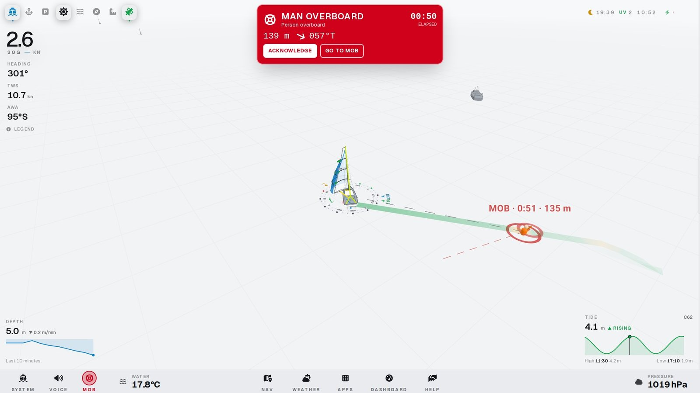 | 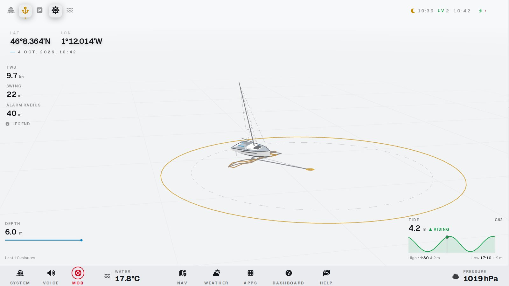 |
| **Homme à la mer.** Un bouton (ou toute notification MOB Signal K) déclenche l’alarme : point de chute, position estimée de la personne maintenant d’après courant et dérive, ligne de dérive, relèvement et distance à suivre. | **Veille au mouillage.** Rayon d’alarme et anneau de veille à 80 % centrés sur l’ancre, la ligne de mouillage, et la trace réellement décrite par le bateau : une renverse ou une ancre qui chasse se voient à sa forme bien avant l’alarme. Gardée par [ocearo-core](https://github.com/laborima/ocearo-core), elle survit à un rechargement. |

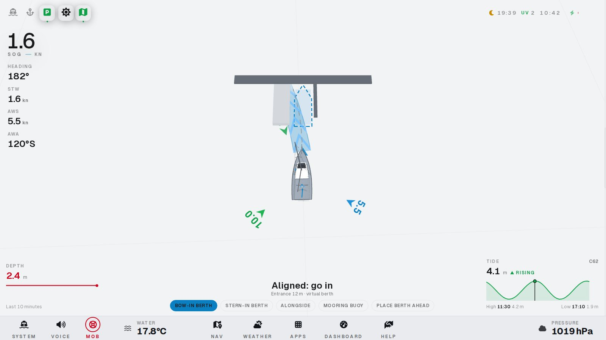

**Aide au port.** Choisissez la place (cul à quai, pointe avant, à couple, coffre) et suivez la trajectoire prévue avec le vent et le courant.

---

## Instruments et systèmes du bord

| | |
|---|---|
| 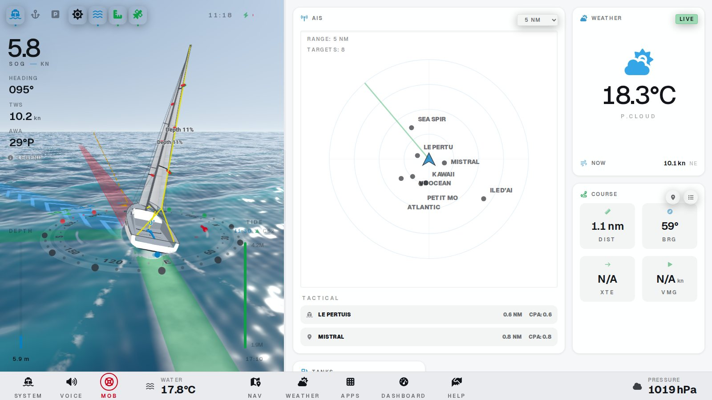 | 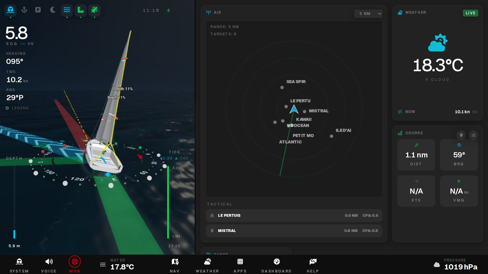 |
| **Tableau de bord.** Radar AIS, météo, route vers le waypoint, réservoirs… à côté de la vue 3D, en thème jour… | …et en thème sombre, dans l’esprit de l’affichage FSD de Tesla : anthracite, formes claires, accents lumineux. |
| 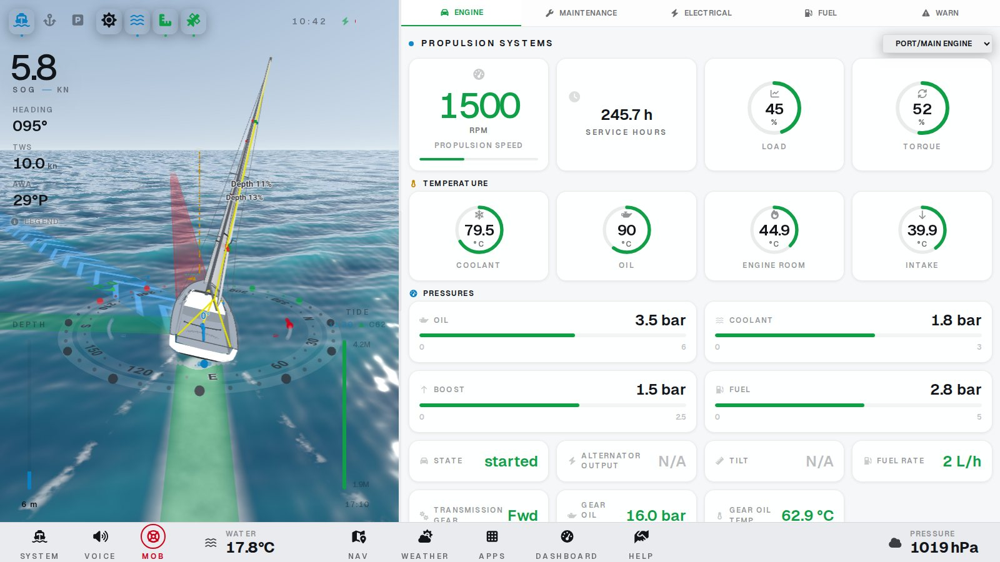 | 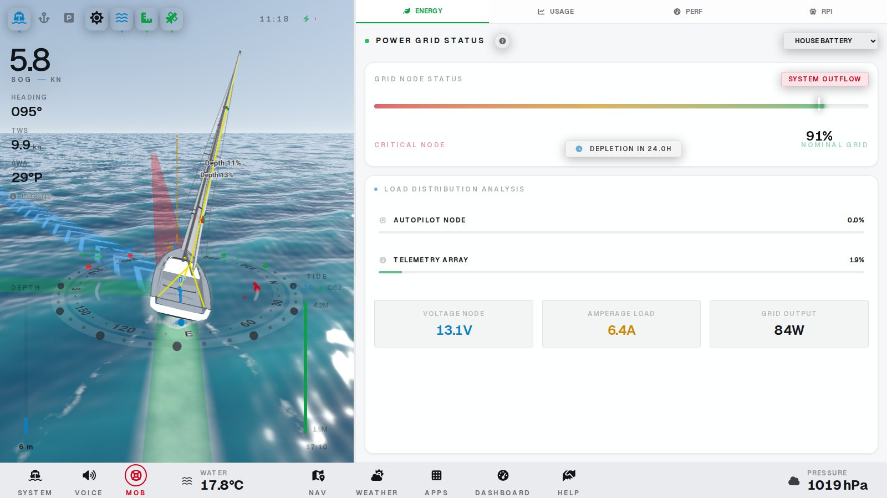 |
| **Moteur.** Régime, heures, températures, pressions, inverseur et alarmes (les 24 notifications moteur NMEA 2000), plus un calendrier d’entretien. | **Énergie.** Batteries, charge et consommation, solaire, et l’état du Raspberry Pi qui fait tourner l’ensemble. |
| 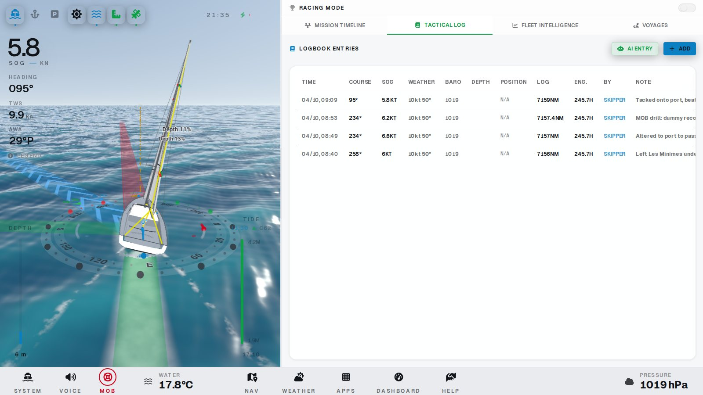 | 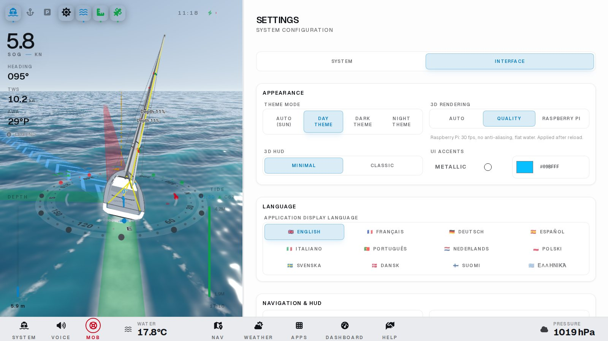 |
| **Journal de bord.** Entrées automatiques et manuelles, chronologie, et sorties enregistrées à rejouer dans la vue 3D. | **Réglages.** Bateau, unités, langue, thèmes, qualité 3D (dont un profil Raspberry Pi), seuils d’alarme et données hors-ligne. |

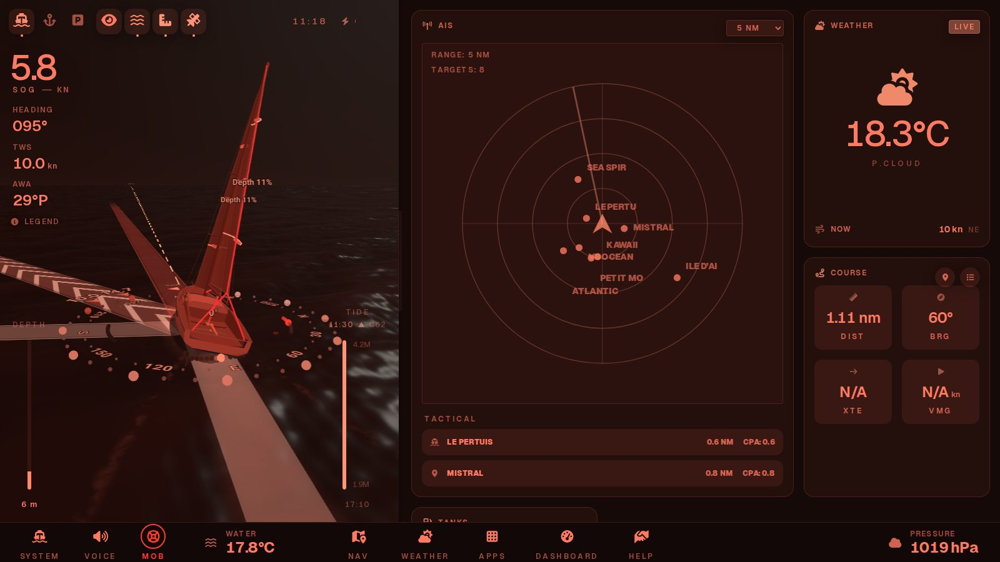

**Thème nuit.** Uniquement du rouge et du rouge orangé, pour préserver la vision de nuit, avec des valeurs plus lumineuses que les libellés pour rester facile à lire. Le thème peut changer tout seul avec le soleil.

---

## Hors-ligne en mer

En mer, internet est rare. Dès qu’il y en a (Wi-Fi du port, 4G), Ocearo garde ce dont il aura besoin :

- Les **tuiles de carte** déjà affichées, les **prévisions de vent** et la **bathymétrie** sont gardées dans le navigateur de l’écran ; *Réglages → Données hors-ligne* télécharge d’un coup la bathymétrie et la prévision sur 5, 10 ou 20 NM autour du bateau.
- Avec **[ocearo-core](https://github.com/laborima/ocearo-core)** sur le serveur, les **relevés SHOM** (modèles numériques de terrain de 5 à 20 m des côtes françaises, données ouvertes) sont téléchargés par le serveur lui-même et partagés avec tous les écrans du bord.
- Les serveurs de tuiles OpenStreetMap interdisent le téléchargement en masse : pour une carte complète hors-ligne, ajoutez des cartes MBTiles au serveur Signal K, qu’Ocearo utilise alors automatiquement.

---

## Installation

Ocearo UI est une **webapp** Signal K.

1. Sur votre serveur Signal K (≥ 2.x), ouvrez **Appstore → Available**, cherchez **ocearo-ui** et installez-le (ou `npm install ocearo-ui` dans `~/.signalk`).
2. Redémarrez le serveur et ouvrez `http://<serveur-signalk>:3000/ocearo-ui/` sur n’importe quel écran du bord.
3. Recommandé : installez **[ocearo-core](https://github.com/laborima/ocearo-core)** pour le journal de bord, la veille au mouillage, la bathymétrie SHOM, les métriques système et le copilote IA.

Une démo en ligne avec des données simulées : <https://laborima.github.io/ocearo-ui/>

### Prérequis Signal K

Ocearo lit des chemins Signal K standard ; quand un chemin manque, son affichage est vide plutôt que faux. Sur un bateau NMEA 2000 typique, ces plugins publient ce qu’il lui faut :

| Plugin | Fournit | Utilisé par |
|--------|---------|-------------|
| [`signalk-derived-data`](https://www.npmjs.com/package/signalk-derived-data) | Vent réel et cap vrai (activer `heading`, `angleTrueWater`, `directionTrue`) | Vent, réglage des voiles, polaires, compas |
| [`@meri-imperiumi/signalk-autostate`](https://www.npmjs.com/package/@meri-imperiumi/signalk-autostate) | `navigation.state` | Affichage des voiles, priorité des alertes |
| [`@signalk/set-system-time`](https://www.npmjs.com/package/@signalk/set-system-time) | Horloge système depuis le GPS | Marées, jour/nuit, journal |
| [`@signalk/signalk-autopilot`](https://www.npmjs.com/package/@signalk/signalk-autopilot) | API pilote Signal K v2 | Vue pilote |
| [`ocearo-core`](https://github.com/laborima/ocearo-core) | Journal, mouillage, bathymétrie, métriques système, copilote IA | Journal, veille au mouillage, bathymétrie, onglet Raspberry Pi |

Matériel : un Raspberry Pi 4 ou 5 fait tourner sans peine le serveur et un écran ; choisissez la qualité 3D *Raspberry Pi* sur l’écran du Pi. Tout navigateur récent sert d’écran déporté.

---

## Configuration

Tout se règle dans l’application (**Réglages**) : adresse et authentification du serveur Signal K, modèle de bateau, tirant d’eau et polaires, unités, langue, thème (manuel ou selon le soleil), qualité 3D, échelle AIS et seuils de collision (CPA, TCPA), et données hors-ligne. Les réglages sont propres à chaque écran.

Pour installer l’application en plein écran sur une tablette ou un téléphone (PWA), servez Signal K en HTTPS sur le réseau du bord : voir [docs/ssl.md](docs/ssl.md) (en anglais).

---

## Développement

```bash
git clone https://github.com/laborima/ocearo-ui.git
cd ocearo-ui
npm install
npm run dev        # http://localhost:3000 — indiquez votre serveur Signal K dans les réglages
npm run lint
npm run build      # export statique dans out/
```

Pour essayer un build sur un serveur Signal K, liez-le comme webapp : `npm run link` (lien symbolique de `out/` vers `~/.signalk/node_modules/ocearo-ui`), puis redémarrez le serveur.

Technologies : Next.js 16 (export statique), React 19, Three.js avec React Three Fiber, Tailwind CSS 4, i18next. Les bateaux, les voiles et la flotte AIS sont procéduraux (aucun modèle à télécharger) ; les conventions du projet sont dans [AGENTS.md](AGENTS.md).

Les tables de marée pour le hors-ligne sont dans `public/tides/<port>/<MM>_<aaaa>.json`.

---

## Sources de données et crédits

- Cartes © contributeurs [OpenStreetMap](https://www.openstreetmap.org/copyright) (ODbL) ; balisage © [OpenSeaMap](https://openseamap.org) (CC BY-SA).
- Bathymétrie : modèles numériques de terrain du [SHOM](https://data.shom.fr) (Licence Ouverte Etalab 2.0), servis par ocearo-core ; relief mondial issu des [tuiles Terrarium](https://registry.opendata.aws/terrain-tiles/) d’AWS Open Data (GEBCO, ETOPO, SRTM et autres).
- Prévision de vent : [Open-Meteo](https://open-meteo.com) (CC BY 4.0).
- Position du soleil : équations du calculateur solaire de la NOAA.

---

## Contribuer

Rapports de bugs, idées et pull requests sont bienvenus — voir les [issues](https://github.com/laborima/ocearo-ui/issues). Les changements sont listés dans le [CHANGELOG](CHANGELOG.md).

[](https://www.buymeacoffee.com/laborima)

## Licence

[Apache 2.0](LICENSE).

## Avertissement de navigation

Ocearo UI améliore la conscience de la situation ; ce **n’est pas un système de navigation ou de sécurité certifié** et il ne doit pas être la seule source d’information de navigation. Recoupez toujours avec les cartes et instruments officiels, veillez et appliquez les règles de barre. Les auteurs déclinent toute responsabilité en cas d’incident lié à son utilisation.
