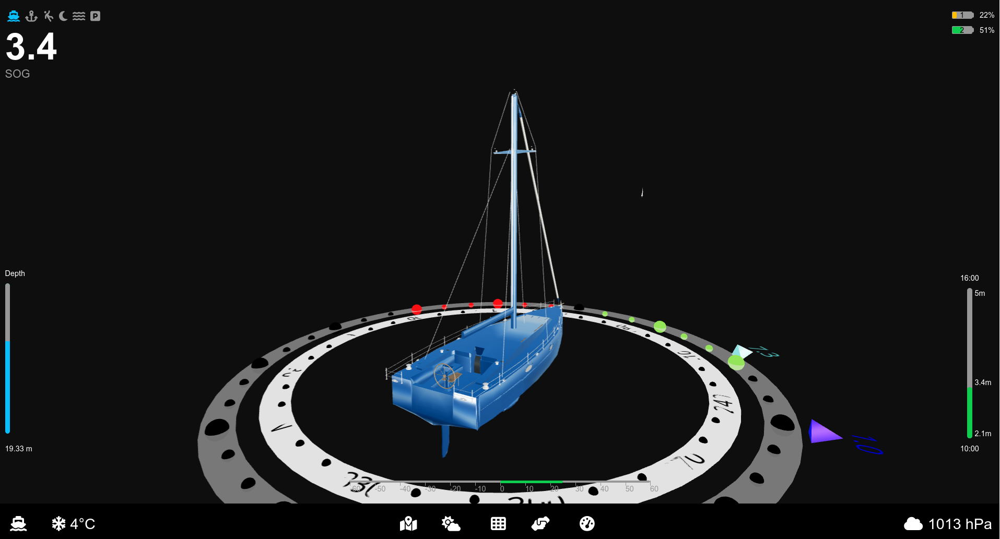
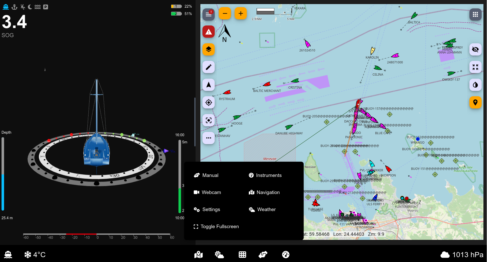
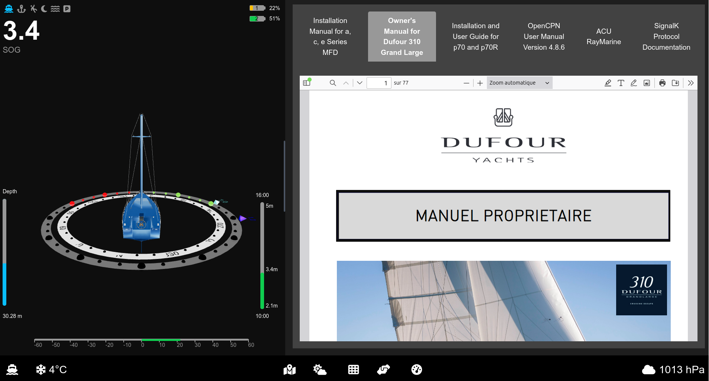
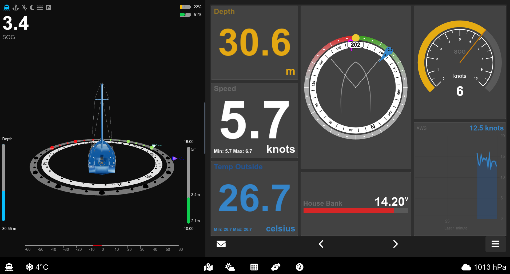
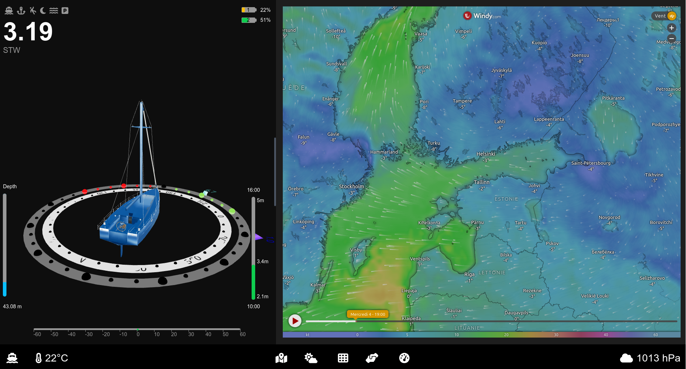

# Ocearo UI

**Sailing Made Smarter**

**Ocean Robot** is set to transform sailing with an intuitive and visually engaging user interface (UI) designed for the OpenPlotter boat project. Powered by the **Signal K** platform, Ocean Robot gathers and stores boat data to provide real-time insights.

Inspired by Tesla's autopilot UI, this system delivers a futuristic and streamlined experience tailored for sailors.

---

## **Core Views**

### **Cruising View**
- **3D Visualization**: Provides a dynamic 3D view of the vessel, displaying critical elements such as:
  - Wind direction with laylines
  - Compass
  - Depth level
  - Nearby boats, represented in 3D using AIS data
- **Future Enhancements**:
  - Integration with advanced camera systems (e.g., **see.ai**) to detect floating objects
  - Camera-based monitoring of sail indicators (*penons*) for optimal sail trim suggestions



### **Anchored View**
- Simplified 3D representation of the vessel with key at-anchor data, including:
  - GPS position
  - Time
  - Tide levels
  - Depth
  - Battery status


### **Park Assist View**
- Leverages camera and sensor data to simplify docking by:
  - Displaying trajectory predictions based on wind and rudder angle
  - Showing speed indications and live feeds from the front camera
  - Highlighting available berthing spots

*Currently in progress.*

### **Man Overboard (MOB) View**
- Features 3D visualization to pinpoint the location and direction of the person overboard, ensuring precise and timely rescue operations.

### **Other Views**
Additional visuals enhance the system's functionality:

  
  
  


---

## **Vision for the Future**
Ocean Robot's roadmap includes advanced features aimed at enhancing safety and efficiency for sailors:

- **AI-powered object detection** for floating debris and obstacles
- **Real-time sail adjustment recommendations** based on wind conditions and sail positions

---

## **Development and Deployment**

### Building

Start the development server:

```bash
npm run dev
# or
yarn dev
# or
pnpm dev
# or
bun dev
```

Access the UI at [http://localhost:3000](http://localhost:3000) in your browser.

Edit the page by modifying `app/page.js`. Changes update automatically as you save.

### Dependencies

Install necessary packages:

```bash
npx create-next-app@latest
npm install @signalk/client @react-three/fiber @react-three/drei
npm install @fortawesome/react-fontawesome @fortawesome/free-solid-svg-icons
```

This project uses [`next/font`](https://nextjs.org/docs/basic-features/font-optimization) to optimize and load the Inter font.

### Boat Models

All 3D boat models have a waterline length of 10 meters and are positioned at 0 on the Y-axis. Use Blender to make any adjustments.

---

## **Deploying to OpenPlotter**

Run the deployment script:

```bash
./deploy.sh
```

### Adding to OpenPlotter Startup

Edit the LXDE startup configuration to launch the UI in kiosk mode:

```bash
vi ~/.config/lxsession/LXDE-pi/autostart
@chromium-browser --start-fullscreen --kiosk --disable-restore-session-state --app=https://localhost:3000/ocearo-ui
```

- `--kiosk`: Launches Chromium in fullscreen mode, preventing exit via keyboard shortcuts.
- `--disable-restore-session-state`: Prevents Chromium from restoring tabs after unexpected closures.
- `--noerrdialogs`: Suppresses error dialogs.

---

## **Sample Boat Integration**

  
  


---

Thanks to OpenPlotter, Signal K, and the MacArthur Hat project for their foundational work. The system also integrates with additional tools such as Windy App, Kip Dashboard, and Freeboard-SK.

Special thanks to open-source 3D model contributors for enhancing the visual experience.