[](https://github.com/laborima/ocearo-ui/issues)
[](CONTRIBUTING.md)
[](https://opensource.org/licenses/Apache-2.0)

[Français 🇫🇷](README.fr.md)

# Ocearo UI

**Sailing Made Smarter**

**Ocean Robot** is set to transform sailing with an intuitive and visually engaging user interface (UI) designed for the OpenPlotter boat project. Powered by the **Signal K** platform, Ocean Robot gathers and stores boat data to provide real-time insights.

Inspired by Tesla's autopilot UI, this system delivers a futuristic and streamlined experience tailored for sailors.

---

## **Latest Updates (v2.0.0)**

- **Advanced 3D Physics & Sails**: Full 3D jib/genoa and mainsail with dynamic camber, twist, and forestay visualization.
- **Dynamic Rigging & Tensions**: Real-time visualization of rigging lines (backstay, vang, cunningham, outhaul) with tension-based color gradients.
- **Sail Trim HUD**: Compass-style arc indicators for sail car positions (GV/Mainsail and Jib) integrated into the 3D compass.
- **Autopilot & Navigation**: Dedicated Autopilot view, Course widget with Signal K routes/waypoints, and high-precision 3D laylines.
- **Integrated Dashboard**: Right-pane dashboard featuring AIS radar, tide, weather, and tank levels for consolidated awareness.
- **Comprehensive Monitoring**: New engine monitoring gauges (temp, pressure, fuel), fuel log utilities, and logbook view.
- **Weather & Forecasts**: Weather context with Signal K forecast API support and offline data fallbacks.
- **Configurable Units & Paths**: Support for custom units (kn, m/s, °C, etc.) and preferred Signal K data paths for wind and heading.
- **Enhanced UI/UX**: Redesigned AIS panel, Tesla-style gauge bars, transparent toolbars, and dynamic day/night skybox.
- **Debug Tools**: Dedicated debug panel with wind override controls and 3D axes toggle.
- **Modern Tech Stack**: Fully migrated to Next.js 16, React 19, and Tailwind CSS v4.

---

## **Key Features**

### **Dynamic 3D Environment**
- **Physically-based Sails**: Real-time 3D representation of mainsail and jib/genoa with dynamic camber, twist, and reefing based on wind conditions.
- **Interactive Rigging**: Visualization of rigging lines (backstay, vang, cunningham, outhaul) with tension-based color gradients.
- **Smart Compass**: Integrated **Sail Trim HUD** showing recommended car positions for optimal performance.
- **Day/Night Skybox**: Dynamic lighting and ocean environment that synchronizes with vessel time.

### **Navigation & Awareness**
- **AIS Radar**: Real-time 3D visualization of nearby vessels with detailed information panels.
- **Course & Routing**: Dedicated widget for Signal K routes, waypoints, and real-time course calculations.
- **Environmental Context**: Integrated tide levels, weather forecasts (Signal K Weather API), and depth monitoring with vessel attitude.
- **Laylines**: High-precision 3D laylines to assist in tactical navigation.

### **Vessel Systems**
- **Autopilot Control**: Fully integrated autopilot interface for seamless vessel management.
- **Engine Monitoring**: Comprehensive gauges for temperature, pressure, and fuel consumption with refill tracking.
- **Tesla-style Indicators**: Modern, high-visibility bars for battery status and tank levels.
- **Customizable UI**: Support for 12 languages and configurable units (metric, imperial, nautical).

---

## **Core Views**

### **Cruising View**
- **3D Visualization**: Provides a dynamic 3D view of the vessel, displaying critical elements such as:
  - Wind direction with **active laylines**
  - High-precision 3D Compass
  - Depth level & vessel attitude
  - Nearby vessels represented in 3D using AIS data
  - **Sail Trim HUD**: Real-time arc indicators for mainsail traveller and jib cars at compass level.
  - Physically-based sail shape (camber & twist) reflecting current wind conditions.

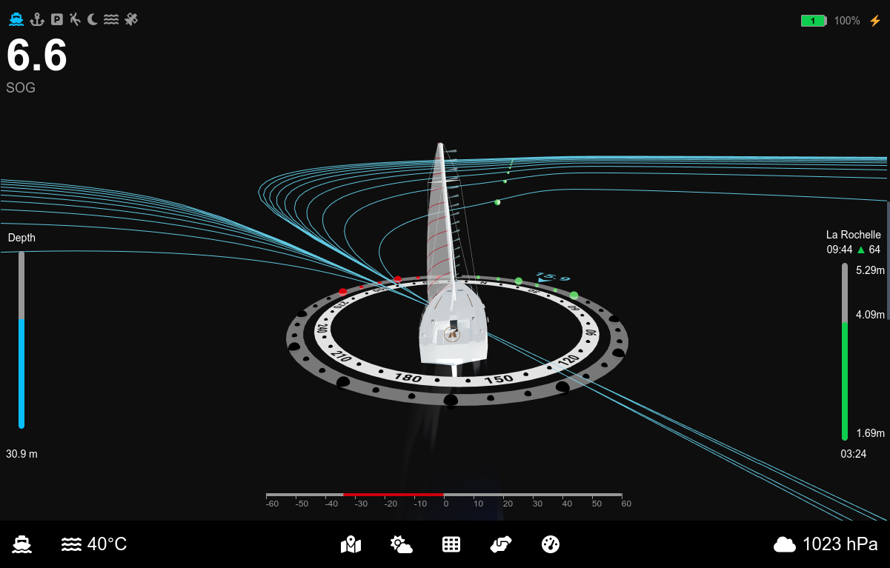

### **Anchored View**
- Simplified 3D representation of the vessel with key at-anchor data, including:
  - GPS position
  - Time
  - Tide levels
  - Depth
  - Battery status

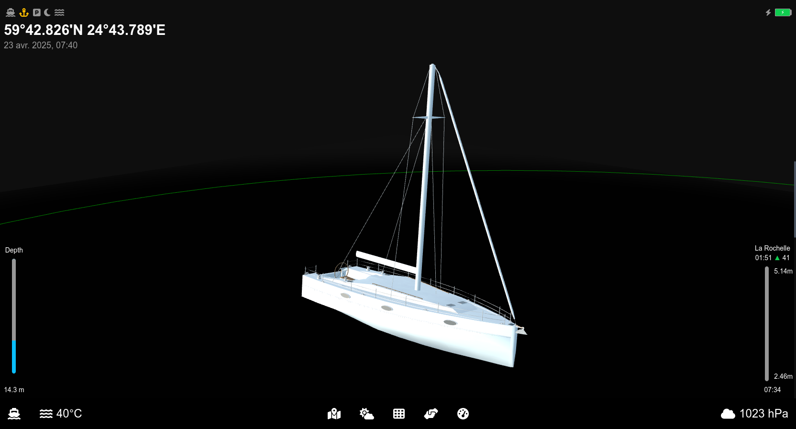

### **Park Assist View**
- Leverages camera and sensor data to simplify docking by:
  - Displaying trajectory predictions based on wind and rudder angle
  - Showing speed indications and live feeds from the front camera
  - Highlighting available berthing spots

*Currently in progress.*

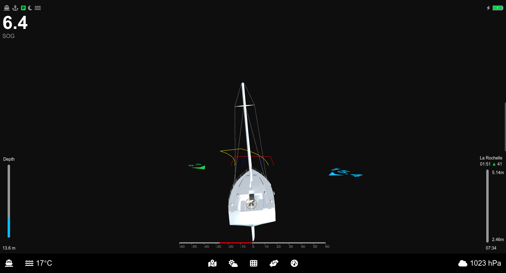

### **Other Views**
Additional visuals enhance the system's functionality:

  
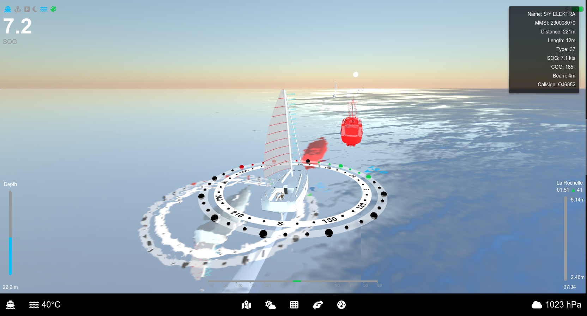
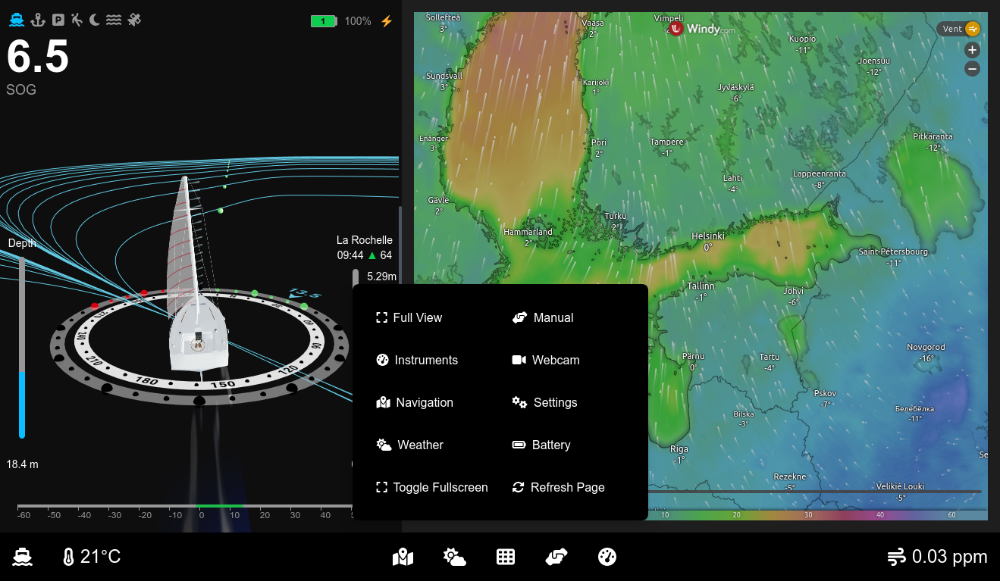  
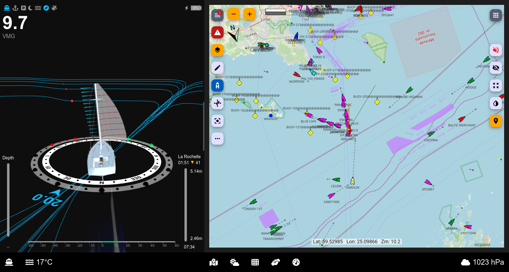  
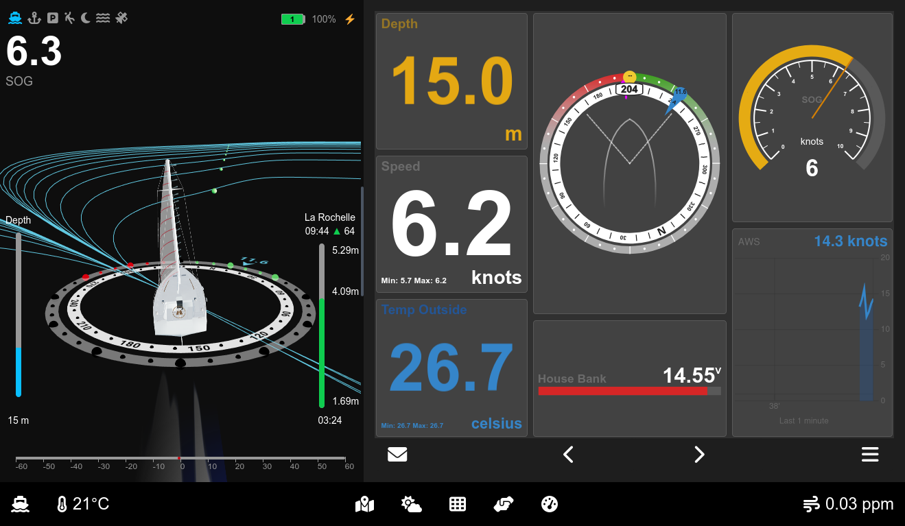
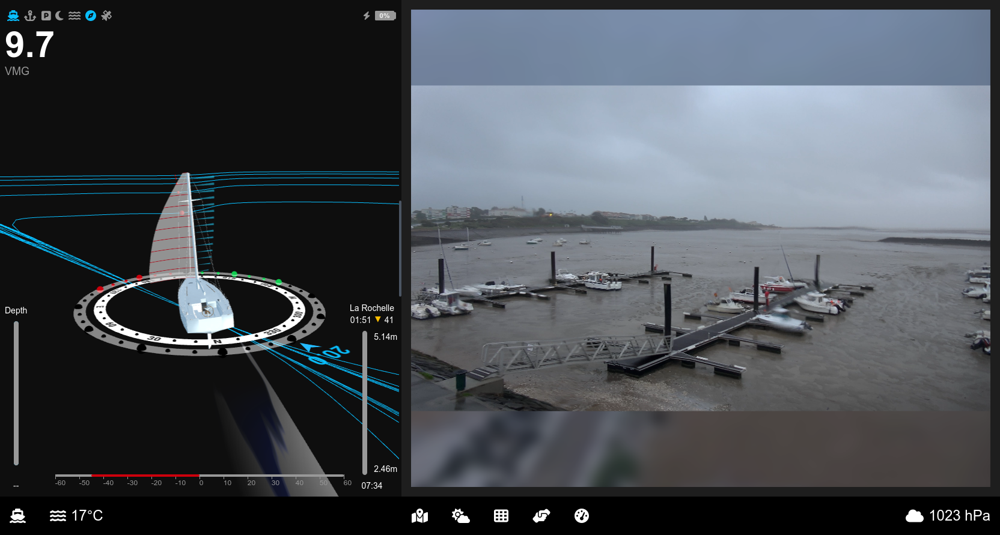
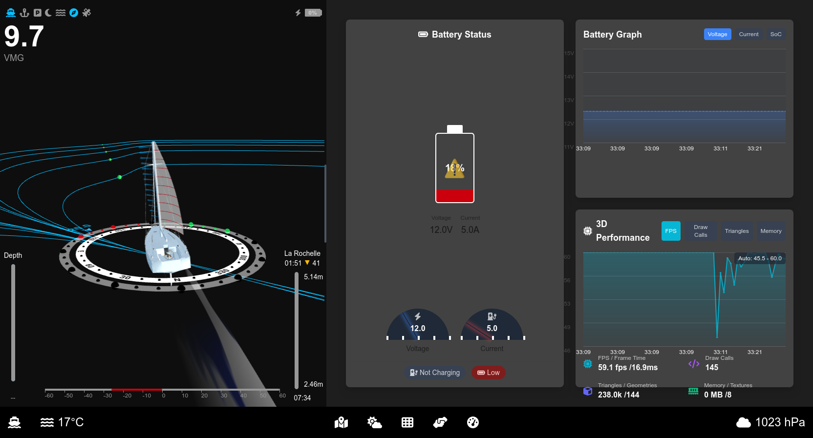
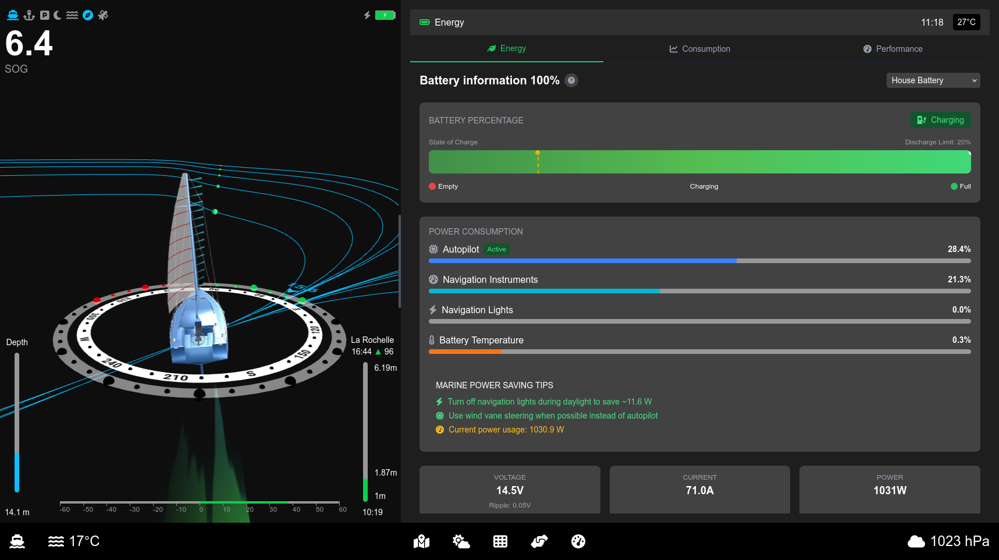
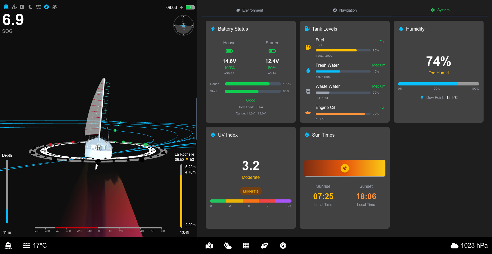
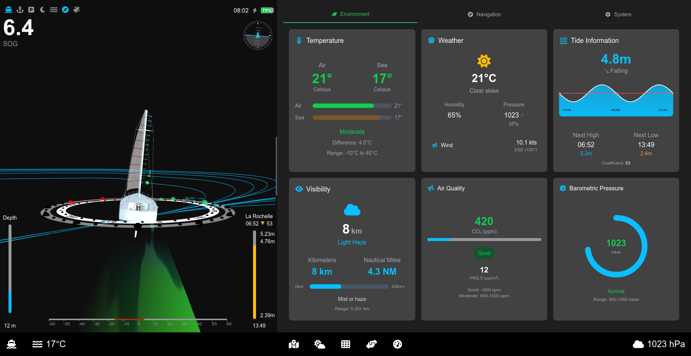
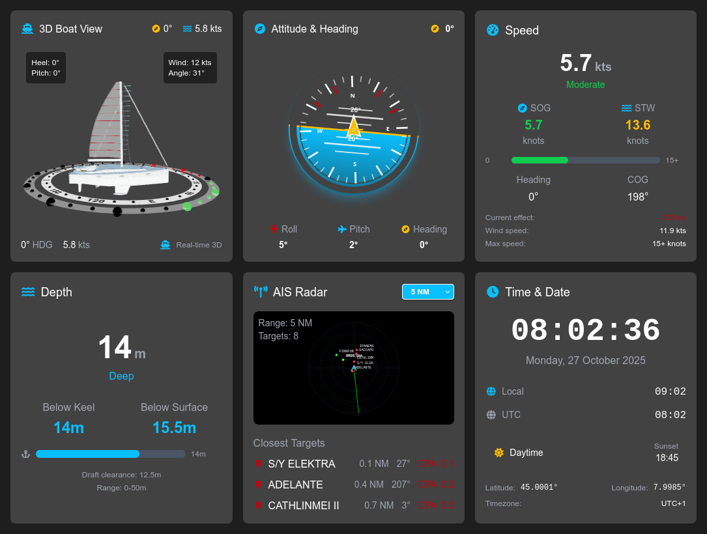
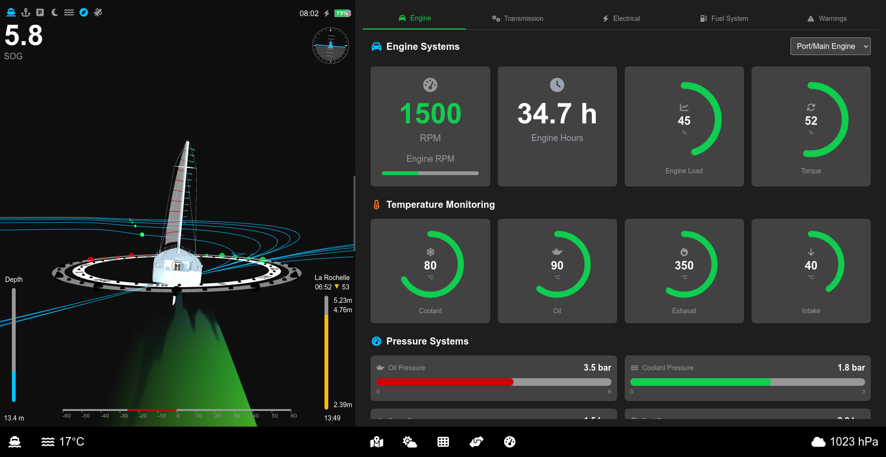

---

## **Vision for the Future**
Ocean Robot's roadmap includes advanced features aimed at enhancing safety and efficiency for sailors:

- **AI-powered object detection** for floating debris and obstacles
  - Integration with advanced camera systems (e.g., **see.ai**) to detect floating objects
- **Future Enhancements**:
  - Camera-based monitoring of sail indicators (*penons*) for optimal sail trim suggestions
  - 3D Bathymetry visualization
  - 3D Start lines visualization
  
---

Check out the live demo: https://laborima.github.io/ocearo-ui/

Or install it in Signal K using the NPM package: https://www.npmjs.com/package/ocearo-ui

---

## **Contributing**

Your support and involvement make Ocearo UI better! Here are some ways you can contribute:

- Report bugs: Help me squash issues by letting me know when something isn't working as expected.
- Suggest features: Share your ideas for new features or improvements your feedback shapes the project!
- Contribute code: Submit pull requests to add features, fix bugs, or improve documentation.
- Support the project: Help fund the purchase of webcams, and sensors by buying me a coffee.

[](https://www.buymeacoffee.com/laborima)

---

## **Development and Deployment**

### Building

Clone sources:

```bash
git clone https://github.com/laborima/ocearo-ui.git
cd ocearo-ui
```

Install dependencies:

```bash
npm install
```

Start the development server:

```bash
npm run dev
```

Access the UI at [http://localhost:3000](http://localhost:3000) in your browser.

Edit the page by modifying `app/page.js`. Changes update automatically as you save.

### Boat Models

All 3D boat models have a waterline length of 10 meters and are positioned at 0 on the Y-axis. Use Blender to make any adjustments.

---
### Setup Tides Data

Create JSON files and stores tide data under the following path:

`public/tides/${harbor}/${MM}_${yyyy}.json`

A sample script allows downloading tide data for La Rochelle.

---

## **Deploying to OpenPlotter**

The recommended way is to use the npm published package.
If you want to deploy your own build:

```bash
git clone https://github.com/laborima/ocearo-ui.git
cd ocearo-ui
npm install
NODE_ENV=production npm run build
scp -r ./out/* pi@openplotter.local:/home/pi/.signalk/node_modules/ocearo-ui
```

---

⚠ Navigation Disclaimer

Use with Caution – Not a Substitute for Official Navigation Systems

Ocearo UI is designed to enhance sailing awareness and provide real-time data visualization. However, this software is not a certified navigation or safety system and should not be relied upon as the sole source of navigational information.

- Always cross-check data with official marine charts, GPS devices, and other navigation aids.
- Maintain situational awareness and follow maritime safety regulations.
- The developers of Ocearo UI are not liable for any incidents, accidents, or navigation errors that may arise from using this software.

By using Ocearo UI, you acknowledge and accept the inherent risks of relying on non-certified navigation tools. Always navigate responsibly!
