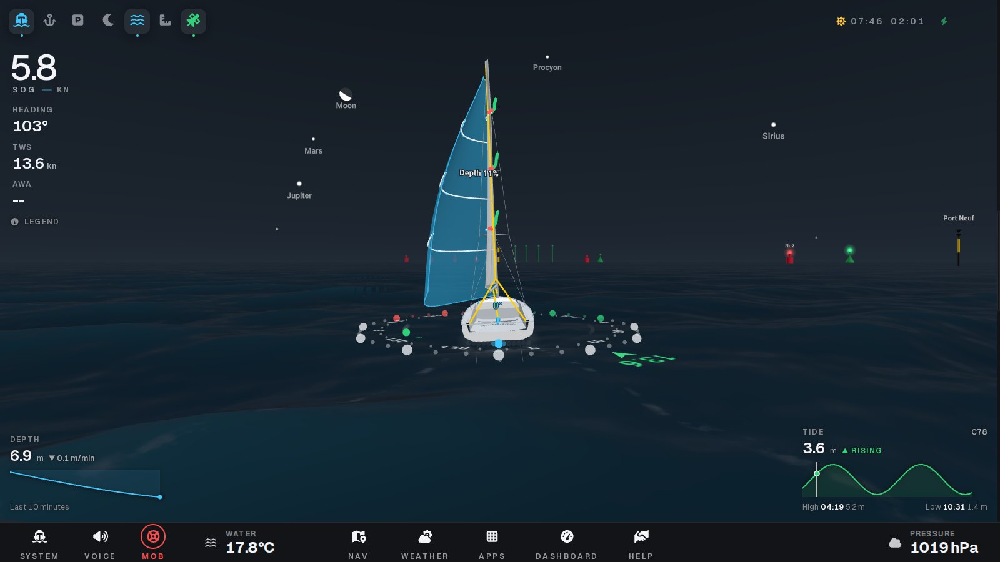
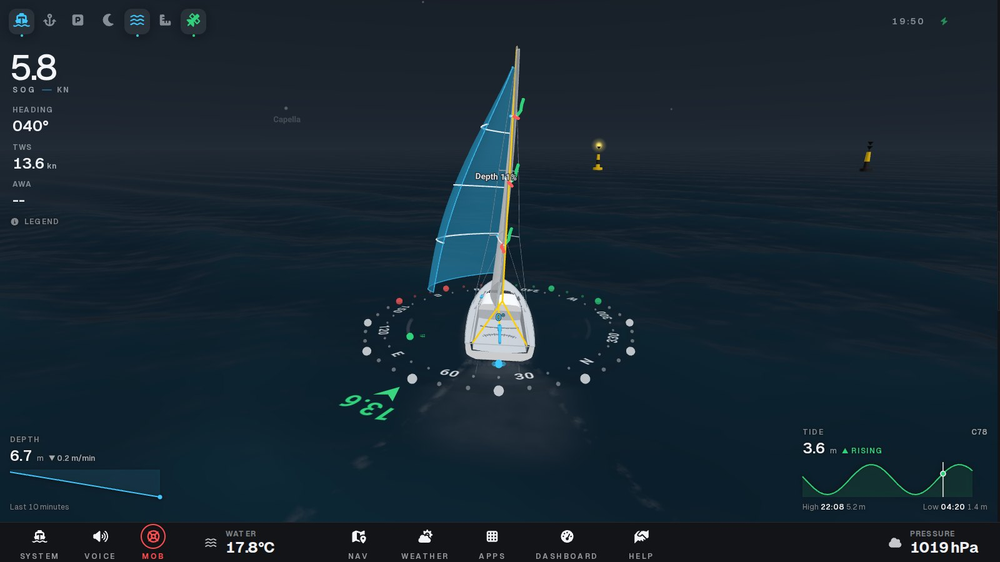
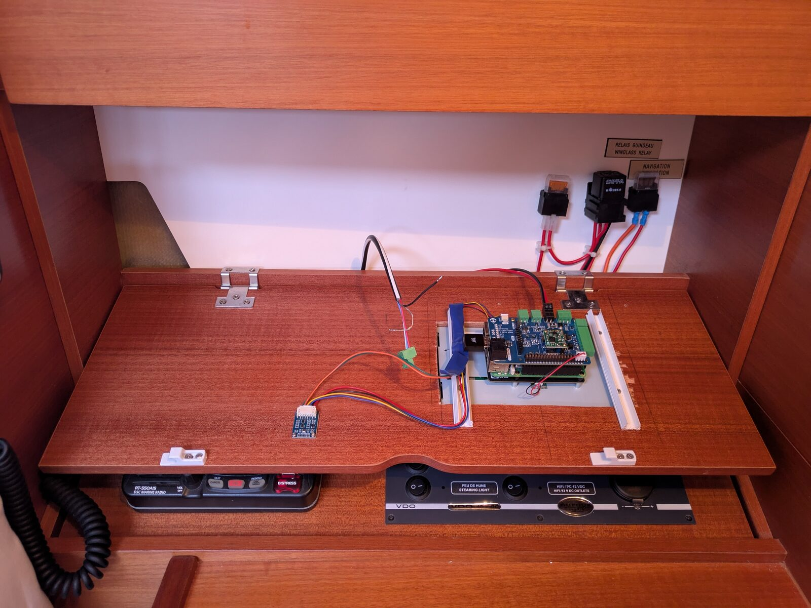
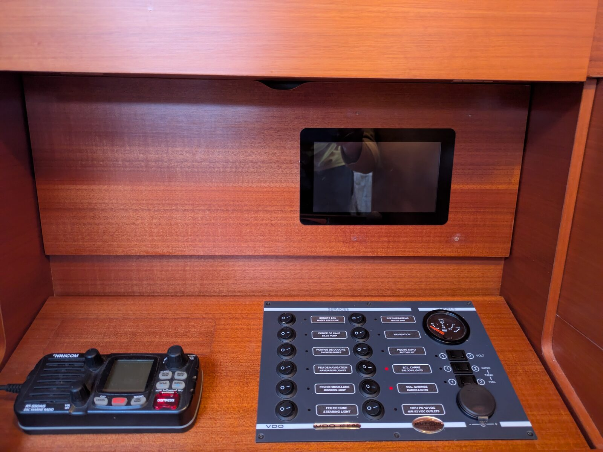
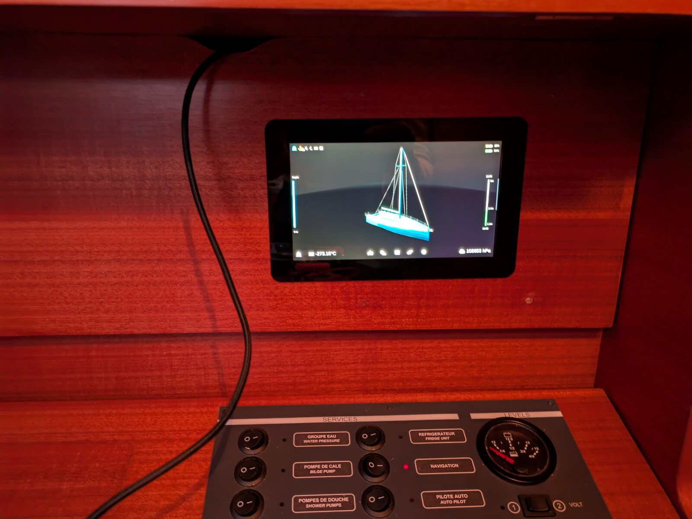

[](LICENSE)
[](https://www.npmjs.com/package/ocearo-ui)
[](https://signalk.org)
[](https://github.com/laborima/ocearo-ui/issues)

[Français 🇫🇷](README.fr.md)

<p align="center">
  <picture>
    <source media="(prefers-color-scheme: dark)" srcset="docs/logo/ocearo-logo-dark.svg">
    
  </picture>
</p>

# Ocearo UI

**The open-source sailing display for Signal K.** A clear, real-time 3D picture of the boat, the sea and the traffic around it — sail trim, rules of the road, man overboard, anchor watch, bathymetry and weather — in a calm interface inspired by Tesla's driving visualisation. It runs as a Signal K webapp on the boat's server (a Raspberry Pi is enough) and in any browser on board: chart-table screen, cockpit tablet or phone.


> Every image on this page is a screenshot of the app, fed with real data for La Rochelle on 4 October 2026: wind from Open-Meteo, tides, the SHOM 20 m bathymetry and scripted AIS traffic.

▶ **Video tour (2:33):** [in English](https://youtu.be/ZDUoifu3cdI) · [en français](https://youtu.be/gu08pE906Ms) — leaving La Rochelle, the rules of the road, man overboard, bathymetry, weather, engine and logbook.

---

## Contents

- [Highlights](#highlights)
- [The 3D view](#the-3d-view)
- [Traffic and the rules of the road](#traffic-and-the-rules-of-the-road)
- [Safety: man overboard and anchor watch](#safety-man-overboard-and-anchor-watch)
- [Instruments and boat systems](#instruments-and-boat-systems)
- [Offline at sea](#offline-at-sea)
- [On board](#on-board)
- [Installation](#installation)
- [Configuration](#configuration)
- [Development](#development)
- [Data sources and credits](#data-sources-and-credits)
- [Contributing](#contributing) · [Licence](#licence) · [Disclaimer](#navigation-disclaimer)

---

## Highlights

- **A boat you can trim from the screen.** Main, headsails and asymmetric spinnaker drawn from the wind (camber, twist, reefs, sail changes), with draft stripes, telltales and the traveller and jib cars where they should be.
- **The sea around you, five ways.** A realistic sea built from the true wind (or measured by a motion sensor), the live chart with buoyage, the seabed in 3D, the wind forecast, or a clean FSD-style ground for racing — with the buoys and beacons in 3D and the real night sky.
- **Traffic you can read at a glance.** AIS targets drawn as real ship types and sizes, moving smoothly between reports, coloured by who must give way under COLREG — with the manoeuvre to make.
- **Tactics.** Laylines to the waypoint, isochrones from your polars (where you will be in 5, 10 and 15 minutes), VMG advice and a polar-speed ghost boat.
- **Safety first.** Man-overboard marker with drift prediction, anchor watch with the real swing track, shallow-water warnings against your draft.
- **Everything else on board.** Dashboard, engine and maintenance, energy, tanks, logbook with voyage replay, autopilot, media and documents — in 12 languages, metric, imperial or nautical units, day, dark and red night themes.
- **Built for the boat.** Works offline once the area is downloaded, adapts to a Raspberry Pi, reads standard Signal K paths only.

---

## The 3D view

The heart of Ocearo is a live 3D scene centred on your boat. A button cycles between five representations of the world around it.

| | |
|---|---|
|  |  |
| **Chart.** OpenStreetMap with OpenSeaMap buoyage and lights, true to scale with your boat and the AIS targets. Uses a Signal K chart provider (MBTiles) when one is installed. | **Bathymetry.** The seabed as a survey grid: relief exaggerated, isobaths, soundings at the current tide, a sounder line from the keel, and water too shallow for your draft hatched in orange. 5–20 m SHOM surveys on the French coast, global relief elsewhere. |
|  |  |
| **Weather.** The 48-hour wind forecast around the boat (Open-Meteo) in Windy colours, with a time slider. | **Polars and laylines.** Where the polars put you in 5, 10 and 15 minutes on every heading, the laylines to the waypoint and the VMG to steer. |
|  |  |
| **Night sky.** The 57 navigational stars and Polaris, Venus, Mars, Jupiter, Saturn and the Moon with its phase, where they really are from your position and the GPS time (within a few arc minutes); the brightest are named. 2 November 2026, 02:00, off La Rochelle. | **Buoys and beacons.** Cardinal, lateral, isolated danger, safe water and special marks in 3D from OpenSeaMap, with their colours, topmark and light flashing its real rhythm at night, and the AIS aids to navigation received (virtual ones as a ghost), also on the radar. Downloaded once, kept offline; can be turned off. |

The **sea** itself is generated from the true wind: wave height, length and direction of a coastal wind sea plus a swell, whitecaps from about 7 knots, the sky's reflection and the sun where it really is, and your own wake following the track you actually sailed. With a motion sensor in Signal K (for instance [ocean-imu](https://github.com/bareboat-necessities/ocean-imu)), the waves take the measured height and period, and the boat rolls, pitches and heaves with it. The sails are drawn from the apparent wind with their trim: draft stripes with the depth and position of maximum camber, telltales on the luff and leech, and the sheet cars on their tracks.

Boats: a 10.8 m racer (default), a 14 m catamaran and simpler models, chosen in the settings.

---

## Traffic and the rules of the road

| | |
|---|---|
|  |  |
| **Our move.** A vessel engaged in fishing crosses ahead: under rule 18 the sailing yacht keeps clear. The boat and the banner turn orange-red, the advice names the rule and the alteration (“Avoid: 15° to port”). | **Their move.** A port-tack yacht closing from starboard must keep clear (rule 12): it turns violet with the manoeuvre expected of it. If it does not act, rule 17(b) advice appears. |
|  |  |
| **Busy water.** Every target carries its role and the rule: the ferry and the cargo ship must keep clear of a yacht under sail (18), the catamaran is to windward on the same tack (12 a-ii), the fishing vessel has right of way. When no single alteration clears everyone, the advice says so and asks to slow down. | **Under engine.** Motoring, the yacht is a power-driven vessel: a cargo ship on the starboard side has right of way (rule 15). The advice passes astern of her (“Avoid: 75° to starboard”) and the dashed line marks the closest point of approach. |

**The rules Ocearo applies**, from the AIS status and ship type of each target and from our own (a yacht with its engine running is power-driven):

| Rule | Situation | Who keeps clear |
|------|-----------|-----------------|
| 13 | Overtaking — coming up from more than 22.5° abaft the beam | The overtaking vessel |
| 18 | Different kinds of vessel | Power ⟶ sail ⟶ fishing ⟶ restricted in her ability to manoeuvre |
| 12 | Two sailing vessels | Port tack keeps clear of starboard tack; on the same tack, the windward boat |
| 14 | Head-on between power-driven vessels | Both alter to starboard |
| 15 | Crossing between power-driven vessels | The one with the other on her starboard side, passing astern |
| 17 | We are the stand-on vessel | Hold course and speed; may act when the other does not, must act when the give-way vessel alone can no longer avoid collision |

Narrow channels and traffic separation schemes (rules 9–10) are not modelled: the advice is an aid to the watch, never a decision. With **[ocearo-core](https://github.com/laborima/ocearo-core)** on the server, the same rules are also spoken — *“Collision danger: LE PERTUIS at 0.5 miles, CPA 0.1 miles in 6 minutes. Vessel engaged in fishing, we keep clear, rule 18. Pass astern of her, bearing away or slowing down.”* — including rule 19 in restricted visibility, and the AIS layer button switches the banner and advice off with the targets.

Colours mean the same thing everywhere: **red** — risk of collision and it is our move; **violet** — risk of collision and it is theirs; **orange** — close but no collision course; grey — nothing to report. CPA and TCPA come from both vessels' course and speed; thresholds are set in the settings. AIS targets are drawn by type and length (sailing yachts, catamarans, ferries, cargo ships, tugs, fishing vessels, lifeboats…) and dead-reckoned between reports, so they glide instead of jumping.

---

## Safety: man overboard and anchor watch

| | |
|---|---|
|  |  |
| **Man overboard.** One button (or any Signal K MOB notification) raises the alarm: drop point, the person's estimated position now from current and leeway, the drift line and the bearing and distance to steer. | **Anchor watch.** Alarm radius and 80 % watch ring centred on the anchor, the rode, and the track the boat has actually described around it: a veer or a dragging anchor shows in its shape long before the alarm. Kept by [ocearo-core](https://github.com/laborima/ocearo-core), so it survives a reload. |


**Parking assist.** Choose the berth (bow-in, stern-in, alongside, mooring buoy) and follow the predicted track with wind and current.

---

## Instruments and boat systems

| | |
|---|---|
|  |  |
| **Dashboard.** AIS radar, weather, course to the waypoint, tanks… next to the 3D view, in the day theme… | …and the dark theme, in the spirit of Tesla's FSD display: charcoal, light shapes, luminous accents. |
|  |  |
| **Engine.** Speed, hours, temperatures, pressures, gear and alarms (the 24 NMEA 2000 engine notifications), plus a maintenance schedule. | **Energy.** Batteries, charge and consumption, solar, and the health of the Raspberry Pi running the stack. |
|  |  |
| **Logbook.** Automatic and manual entries, mission timeline, and recorded voyages you can replay in the 3D view. | **Settings.** Boat, units, language, themes, 3D quality (including a Raspberry Pi profile), alarm thresholds and offline data. |


**Night theme.** Red and red-orange only, so the screen keeps your night vision, with values brighter than labels so it stays easy to read. The theme can switch itself with the sun.

---

## Offline at sea

At sea there is rarely internet. Whenever there is (marina Wi-Fi, 4G), Ocearo keeps what it will need:

- **Chart tiles** you have viewed, **wind forecasts** and **bathymetry** are cached in the display's browser; *Settings → Offline data* downloads the bathymetry and forecast for 5, 10 or 20 NM around the boat in one go.
- With **[ocearo-core](https://github.com/laborima/ocearo-core)** on the server, the **SHOM surveys** (5–20 m digital elevation models of the French coast, open data) are downloaded by the server itself and shared with every screen on board.
- OpenStreetMap's tile servers do not allow bulk downloads: for complete offline charts, add MBTiles charts to the Signal K server, which Ocearo then uses automatically.

---

## On board

The installation Ocearo is developed on: behind a panel of the chart table, a Raspberry Pi with a MacArthur HAT (NMEA 0183 and NMEA 2000 interface) runs Signal K, and a touchscreen set into the panel above the switchboard shows the 3D view. Tablets and phones connect to the same server over the boat's Wi-Fi.

| | |
|---|---|
|  |  |
| **Behind the panel.** The Raspberry Pi, its MacArthur HAT and the wiring to the instruments, out of the way but easy to reach. | **At the chart table.** The screen sits flush in the panel, above the switchboard and the VHF. |



*Photos taken with an earlier version of Ocearo.*

---

## Installation

Ocearo UI is a Signal K **webapp**.

1. On your Signal K server (≥ 2.x), open **Appstore → Available**, search for **ocearo-ui** and install it (or `npm install ocearo-ui` in `~/.signalk`).
2. Restart the server and open `http://<signalk-server>:3000/ocearo-ui/` on any screen on board.
3. Recommended: install **[ocearo-core](https://github.com/laborima/ocearo-core)** for the logbook, anchor watch, SHOM bathymetry, system metrics and the AI copilot.

Website: <https://laborima.github.io/ocearo-ui/> · live demo with simulated data: <https://laborima.github.io/ocearo-ui/demo/>

### Signal K prerequisites

Ocearo reads standard Signal K paths; when a path is missing, its display is empty rather than wrong. On a typical NMEA 2000 boat these plugins publish what it needs:

| Plugin | Provides | Used by |
|--------|----------|---------|
| [`signalk-derived-data`](https://www.npmjs.com/package/signalk-derived-data) | True wind and true heading (enable `heading`, `angleTrueWater`, `directionTrue`) | Wind, sail trim, polars, compass |
| [`@meri-imperiumi/signalk-autostate`](https://www.npmjs.com/package/@meri-imperiumi/signalk-autostate) | `navigation.state` | Sail visibility, alert priorities |
| [`@signalk/set-system-time`](https://www.npmjs.com/package/@signalk/set-system-time) | System clock from GPS | Tides, day/night, logbook |
| [`@signalk/signalk-autopilot`](https://www.npmjs.com/package/@signalk/signalk-autopilot) | Signal K v2 autopilot API | Autopilot view |
| [`ocearo-core`](https://github.com/laborima/ocearo-core) | Logbook, anchor, bathymetry, system metrics, AI copilot | Logbook, anchor watch, bathymetry, Raspberry Pi tab |

Hardware: a Raspberry Pi 4 or 5 runs the server and a display comfortably; select the *Raspberry Pi* 3D quality on the Pi's own screen. Any recent browser works as a remote display.

---

## Configuration

Everything is set in the app (**Settings**): Signal K server address and authentication, boat model, draft and polars, units, language, theme (manual or following the sun), 3D quality, AIS scale and collision thresholds (CPA, TCPA), and offline data. Settings are stored per display.

To install the app on a tablet or phone as a full-screen app (PWA), serve Signal K over HTTPS on the boat's network: see [docs/ssl.md](docs/ssl.md).

---

## Development

```bash
git clone https://github.com/laborima/ocearo-ui.git
cd ocearo-ui
npm install
npm run dev        # http://localhost:3000 — point it at your Signal K server in Settings
npm run lint
npm run build      # static export in out/
```

To try a build on a Signal K server, link it as a webapp: `npm run link` (symlinks `out/` into `~/.signalk/node_modules/ocearo-ui`), then restart the server.

Stack: Next.js 16 (static export), React 19, Three.js with React Three Fiber, Tailwind CSS 4, i18next. The 3D boats, sails and AIS fleet are procedural (no model files to download); see [AGENTS.md](AGENTS.md) for the project conventions.

Tide tables for offline use live in `public/tides/<harbour>/<MM>_<yyyy>.json`.

---

## Data sources and credits

- Charts © [OpenStreetMap](https://www.openstreetmap.org/copyright) contributors (ODbL); buoyage © [OpenSeaMap](https://openseamap.org) (CC BY-SA).
- Bathymetry: [SHOM](https://data.shom.fr) digital elevation models (Licence Ouverte Etalab 2.0), served by ocearo-core; global relief from the [Terrarium tiles](https://registry.opendata.aws/terrain-tiles/) on AWS Open Data (GEBCO, ETOPO, SRTM and others).
- Wind forecast: [Open-Meteo](https://open-meteo.com) (CC BY 4.0).
- Sun position: NOAA solar calculator equations.

---

## Contributing

Bug reports, ideas and pull requests are welcome — see the [issues](https://github.com/laborima/ocearo-ui/issues). Changes are listed in the [CHANGELOG](CHANGELOG.md).

**How Ocearo is built.** In the interest of transparency: most of the code was written with AI coding assistants ("vibe coding"). I'm a developer and a sailor; I decide what the app does, review the changes and test it on my own boat, but it is not hand-written line by line. Code reviews are especially welcome.

[](https://www.buymeacoffee.com/laborima)

## Licence

[Apache 2.0](LICENSE).

## Navigation disclaimer

Ocearo UI improves situational awareness; it is **not a certified navigation or safety system** and must not be the only source of navigational information. Always cross-check with official charts and instruments, keep a proper lookout and follow the rules of the road. The authors accept no liability for incidents arising from its use.
