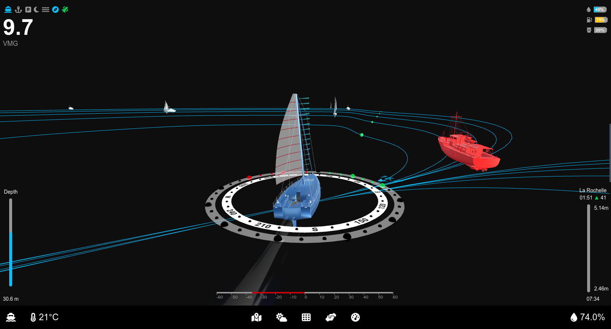

[](https://github.com/laborima/ocearo-ui/issues)
[](CONTRIBUTING.md)
[](https://opensource.org/licenses/Apache-2.0)


# Ocearo UI


**Sailing Made Smarter**

**Ocean Robot** is set to transform sailing with an intuitive and visually engaging user interface (UI) designed for the OpenPlotter boat project. Powered by the **Signal K** platform, Ocean Robot gathers and stores boat data to provide real-time insights.

Inspired by Tesla's autopilot UI, this system delivers a futuristic and streamlined experience tailored for sailors.

---

## **Core Views**

### **Cruising View**
- **3D Visualization**: Provides a dynamic 3D view of the vessel, displaying critical elements such as:
  - Wind direction with laylines
  - Compass
  - Depth level
  - Nearby boats, represented in 3D using AIS data
  - Real-time sail adjustment recommendations based on wind conditions and sail positions




### **Anchored View**
- Simplified 3D representation of the vessel with key at-anchor data, including:
  - GPS position
  - Time
  - Tide levels
  - Depth
  - Battery status


### **Park Assist View**
- Leverages camera and sensor data to simplify docking by:
  - Displaying trajectory predictions based on wind and rudder angle
  - Showing speed indications and live feeds from the front camera
  - Highlighting available berthing spots

*Currently in progress.*


### **Other Views**
Additional visuals enhance the system's functionality:

  

  
  


---

## **Vision for the Future**
Ocean Robot's roadmap includes advanced features aimed at enhancing safety and efficiency for sailors:

- **AI-powered object detection** for floating debris and obstacles
  - Integration with advanced camera systems (e.g., **see.ai**) to detect floating objects
- **Future Enhancements**:
  - Camera-based monitoring of sail indicators (*penons*) for optimal sail trim suggestions
  - 3D Bathymetry visualization
  - 3D Laylines visualization
  - 3D Start lines visualization
  
---

Check out the live demo: https://laborima.github.io/ocearo-ui/

Or install it in Signal K using the NPM package: https://www.npmjs.com/package/ocearo-ui

---

## **Contributing**

Your support and involvement make Ocearo UI better! Here are some ways you can contribute:

* Report bugs: Help me squash issues by letting me know when something isn't working as expected.
* Suggest features: Share your ideas for new features or improvements your feedback shapes the project!
* Contribute code: Submit pull requests to add features, fix bugs, or improve documentation.
* Support the project: Help fund the purchase of webcams, and sensors by buying me a coffee.

[](https://www.buymeacoffee.com/laborima)

---

## **Development and Deployment**

### Building


Clone sources:

```bash
git clone https://github.com/laborima/ocearo-ui.git
cd ocearo-ui
```

Install dependencies:

```bash
npm install next react react-dom
```

Start the development server:

```bash
npm run dev
```

Access the UI at [http://localhost:3000](http://localhost:3000) in your browser.

Edit the page by modifying `app/page.js`. Changes update automatically as you save.

### Boat Models

All 3D boat models have a waterline length of 10 meters and are positioned at 0 on the Y-axis. Use Blender to make any adjustments.


---
### Setup Tides Data

Create JSON files and stores tide data under the following path:

```
public/tides/${harbor}/${MM}_${yyyy}.json
```

A sample script allows downloading tide data for La Rochelle.

#### Example

After downloading, the directory structure for La Rochelle will look like this:

```bash
ls public/tides/larochelle/
01_2025.json  04_2025.json  07_2025.json  10_2025.json  download_data.sh
02_2025.json  05_2025.json  08_2025.json  11_2025.json
03_2025.json  06_2025.json  09_2025.json  12_2025.json
```

#### JSON Format

Each JSON file contains tide data for a specific month. The structure follows this format:

```json
{
    "2025-01-01": [
        [
            "tide.low",
            "11:38",
            "1.45m",
            "---"
        ],
        [
            "tide.high",
            "05:21",
            "5.95m",
            "80"
        ],
        [
            "tide.low",
            "23:56",
            "1.56m",
            "---"
        ],
        [
            "tide.high",
            "17:44",
            "5.7m",
            "81"
        ]
    ]
}
```

Each tide entry consists of:
- **Type**: "tide.low" or "tide.high"
- **Time**: The time of the tide event (HH:MM)
- **Height**: Tide height in meters
- **Coefficient**: If applicable, the coefficient value (otherwise "---")

### Setup SSL for PWA

For complete documentation on setting up SSL, see:

[doc/ssl.md](doc/ssl.md)


### Setup Polar Data

The default POLAR file is based on the Dufour 310 (POL11111) from ORC-DATA.

For improved polar data, you can download a more accurate dataset from:

[ORC Data Repository](https://github.com/jieter/orc-data/blob/master/site/data/)

Save the downloaded file under:

```
/public/boats/default/polar/polar.json
```

### Setup Documentation

Create an `index.json` file and place it under:

```
/public/docs/index.json
```

#### JSON Format

```json
[
    {
        "file": "a, c, e Series MFD Notice d_installation 87247-1-FR.pdf",
        "title": "Installation Manual for a, c, e Series MFD"
    },
    {
        "file": "Manuel propriétaire Dufour 310 Grand Large_2019-06_FR.pdf",
        "title": "Owner's Manual for Dufour 310 Grand Large"
    },
    {
        "file": "p70 et p70R Notice d_installation et d_utilisation 81355-1-FR.pdf",
        "title": "Installation and User Guide for p70 and p70R"
    },
    {
        "file": "OpenCPN User Manual-4-8-6-Sept-18-18-medium-compressed.pdf",
        "title": "OpenCPN User Manual Version 4.8.6"
    }
]
```

## **Deploying to OpenPlotter**

The recommended way is to use the npm published package.
If you want to deploy your own build, you can either adapt and run the provided `deploy.sh` script, or use the following manual steps:

```bash
git clone https://github.com/laborima/ocearo-ui.git
cd ocearo-ui
npm install next react react-dom
NODE_ENV=production npm run build
scp -r -P 22./out/* pi@openplotter.local:/home/pi/.signalk/node_modules/ocearo-ui
```

### Adding to OpenPlotter Startup

Edit the LXDE startup configuration to launch the UI in kiosk mode:

```bash
vi ~/.config/lxsession/LXDE-pi/autostart
@chromium-browser --start-fullscreen --kiosk --disable-restore-session-state --app=https://localhost:3000/ocearo-ui
```

- `--kiosk`: Launches Chromium in fullscreen mode, preventing exit via keyboard shortcuts.
- `--disable-restore-session-state`: Prevents Chromium from restoring tabs after unexpected closures.
- `--noerrdialogs`: Suppresses error dialogs.

---

## **Sample Boat Integration**

  
  


---

Thanks to OpenPlotter, Signal K, and the MacArthur Hat project for their foundational work. The system also integrates with additional tools such as Windy App, Kip Dashboard, and Freeboard-SK.
Thanks to Apparent Wind Sail-Trim Simulator https://github.com/flyinggorilla/simulator.atterwind.info for is work on sail representation
Thanks to https://jieter.github.io/orc-data/site/ for Polar data
Special thanks to open-source 3D model contributors for enhancing the visual experience.

---

⚠ Navigation Disclaimer

Use with Caution – Not a Substitute for Official Navigation Systems

Ocearo UI is designed to enhance sailing awareness and provide real-time data visualization. However, this software is not a certified navigation or safety system and should not be relied upon as the sole source of navigational information.

* Always cross-check data with official marine charts, GPS devices, and other navigation aids.
* Maintain situational awareness and follow maritime safety regulations.
* The developers of Ocearo UI are not liable for any incidents, accidents, or navigation errors that may arise from using this software.

By using Ocearo UI, you acknowledge and accept the inherent risks of relying on non-certified navigation tools. Always navigate responsibly!
